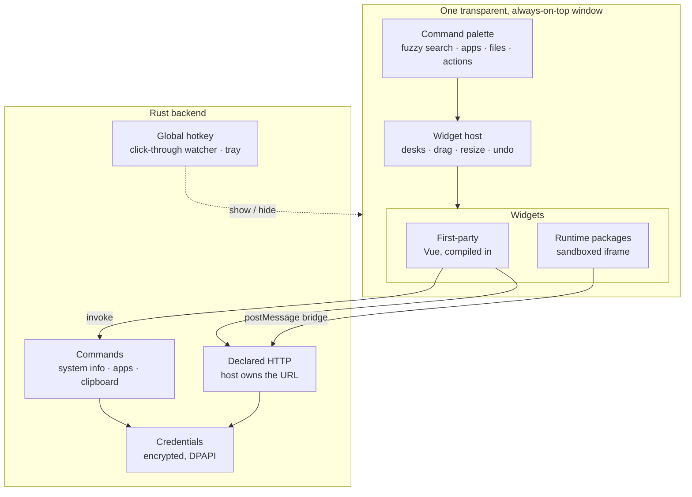

# Kavibay

A Raycast-style launcher with a desk of floating widgets that lives on top of
your wallpaper.

Tapping `Ctrl` twice opens a command palette in the middle of the screen and
brings your widgets with it — a clock, the weather, a todo list, a countdown,
whatever you put there. Tap it twice again and everything disappears; the widgets
you pinned stay. Holding `Ctrl+Space` shows just the widgets for as long as you
keep it down. The window is transparent, always on top, and clicks fall through
the gaps between cards to whatever is behind them, so the desk is a layer over
your desktop rather than another window to manage.

Built with **Tauri v2** (Rust) + **Vue 3** (`<script setup>`, TypeScript) +
**Vite**. Windows 11 is the supported platform today; a macOS port is planned.

> This is a learning-driven project: a clean, explained foundation beats feature
> count. The **widget contract** is the part that gets the attention.



## What you get

- **Command palette** — fuzzy search over commands, installed apps, files and
  your widgets. Type `g rust book` to search Google, `f invoice` for Windows
  Search, `~/dev` to walk paths. `Tab` on a row runs an action with arguments
  ("Set Timer" → `1h30`) instead of just opening the widget.
- **A desk of widgets** — drag, resize, zoom (`Ctrl`+mousewheel or trackpad
  pinch), snap to a grid,
  hide, delete, undo. Widgets are cards the host draws; each one only paints its
  own content.
- **Desks** — several named layouts, `Ctrl+Shift+1…9` to switch. A widget can sit
  on one desk or on all of them.
- **30 built-in widgets** — clock, weather, todo, notes, pomodoro, calendar,
  GitHub Actions, Tado, system info, app launcher, snake… the full table with
  what each one needs is in [extensions/README.md](extensions/README.md).
- **Three ways to add your own** — describe one to the Widget Wizard, write a
  first-party Vue extension, or drop in a sandboxed runtime package. See
  [Building widgets](#building-widgets).
- **Quick actions on selected text** — select text in *any* application, press
  `Ctrl+Shift+Q`, and a small menu appears next to it: translate, fix the grammar,
  turn notes into an email. In a text field the answer replaces the selection;
  anywhere else — a web page, a PDF, anything Kavibay cannot identify as
  editable — it lands on the clipboard instead of being typed somewhere it does
  not belong, and the popup says so before you pick. Nothing else opens — not
  the palette, not your widgets. Pick the model once in **Settings → AI**.
- **Credentials that stay out of widgets** — API keys and OAuth accounts are
  entered once in Settings, encrypted at rest (DPAPI on Windows), and resolved in
  Rust. A widget only ever learns *whether* it is connected.
- **Tray + global hotkey** — the app starts hidden and never dies; the hotkey and
  the tray icon only show and hide it.

## Requirements

| | |
|---|---|
| OS | Windows 11 (Windows 10 should work). Linux runs, macOS is untested — see [Other platforms](#other-platforms) |
| Node | 20 or newer (Vite 6) |
| Rust | Stable toolchain via [rustup](https://rustup.rs/) |
| Build tools | Visual Studio Build Tools with **Desktop development with C++** |
| WebView2 | Ships with Windows 11; on older Windows install the Evergreen runtime |

The Tauri CLI comes from `devDependencies` — no global install needed.

## Run it

```bash
npm install
```

```bash
npm run tauri dev
```

The first run compiles the Rust backend and takes a few minutes; later runs are
fast, and the Vue side hot-reloads.

**Nothing appears — that is correct.** The window starts invisible. Tap `Ctrl`
twice (or double-click the tray icon) to open the cockpit. On the very
first start it opens by itself and a short guided tour points at the pieces;
`Settings → Behavior → Replay tour` brings it back.

`npm run dev` on its own starts only Vite on <http://localhost:1420>. The UI
renders in a browser, but every `invoke` fails — use it for pure CSS work, not
for anything that talks to Rust.

More detail, including what to do when it does not start:
**[docs/getting-started.md](docs/getting-started.md)**.

## Other platforms

**Linux** builds and runs, with one caveat that decides everything: on **Wayland,
pinned widgets do not stay on top**, because Wayland grants no client that right.
On X11 everything works. Prerequisites, the full comparison and how to get an X11
session: [docs/getting-started.md](docs/getting-started.md#run-on-linux).

**macOS** is **untested** — the code paths exist, but nothing has ever been
compiled on a Mac. [What to expect](docs/getting-started.md#run-on-macos).

## Build it yourself

```bash
npm run package:win              # NSIS installer  → src-tauri/target/release/bundle/nsis/
npm run package:win:standalone   # single .exe     → src-tauri/target/release/kavibay.exe
npm run package:linux            # AppImage + .deb → src-tauri/target/release/bundle/
```

Releases are built by [`.github/workflows/release.yml`](.github/workflows/release.yml)
when a `v*` tag is pushed, and land as a draft release with both Windows artifacts, the
Linux AppImage and `.deb`, plus `SHA256SUMS.txt`.

Everything is **unsigned** — no free code-signing option exists that Windows trusts — so
SmartScreen warns on first run ("More info" → "Run anyway"). Check the published SHA256
if you want to be sure of what you downloaded.

Linux builds are X11-only in practice; see [Other platforms](#other-platforms). macOS
packaging is not set up, and the transparent window relies on Apple private APIs, which
rules out the App Store.

## Everyday keys

| Key | Does |
|---|---|
| `Ctrl` `Ctrl` | Show / hide the cockpit — two taps in a row, nothing else pressed in between (Windows only: no OS can register a bare modifier as a hotkey, so this is read from a keyboard hook) |
| `Ctrl+Space` (hold) | Peek at the widgets — no palette, and they disappear again the moment you let go. Click one while holding and that one stays, until you close it |
| `Shift+Ctrl+Space` | Show / hide the cockpit on the screen under the mouse — and the way in on macOS and Linux, where the double tap is unavailable |
| `Ctrl+Shift+Q` | Quick actions on text selected in any app (`↑` `↓` `Enter`, `Escape` closes) |
| `Escape` | Hide it |
| `↑` `↓` `Enter` | Move through palette results and run one — on a widget row, `Enter` puts that widget on the desk |
| `↓` on an empty query | Recently used commands |
| `←` on an empty query | The widgets on this desk, plus the whole catalog |
| `Enter` or a click on a widget row | Give it a card on the desk — create it, show it if it was hidden, or jump to the one already there |
| `Ctrl+Enter` on a widget row | Open it *inside* the palette instead; nothing is added to your layout (`Escape`, `←` or the header's Back button return to the results). The caret lands in the widget where it has one — Notes in the editor, Calculator in its field. The ↗ button in the inline header promotes it to a card and takes the content with it |
| `Tab` | Fill in an action's arguments, or jump into the widget |
| `Ctrl+N` / `Ctrl+H` / `Ctrl+R` | On a palette row: new instance / hide / delete |
| `Ctrl+T` | On a folder row: open it in the terminal |
| `Ctrl+Tab` / `Ctrl+Shift+Tab` | Cycle focus through the open widgets and back to the palette |
| `Ctrl+Alt+S` | Jump into the palette search from any widget, selecting the old query |
| `Ctrl+H` / `Ctrl+R` | On the widget you are in: hide it / delete it (content included) |
| `Ctrl+S` / `Ctrl+D` | On the widget you are in: pin it or unpin it / duplicate it |
| `Ctrl+Shift+1…9` | Switch desk |
| `Ctrl+Z` / `Ctrl+Y` | Undo a hide, delete or move — redo the move. A deleted widget comes back empty |
| `Ctrl+Shift+←↑→↓` | Nudge the focused widget by 10px |
| `Ctrl`+mousewheel · trackpad pinch | Zoom a widget's content (`0.5`…`3`) — on a card and in the inline view, each remembering its own zoom |
| `Ctrl`+drag | Move the whole layout instead of one widget |
| Double-click a widget title | Rename it — on the card, and in the inline panel header |
| Hold the card's `×` | Short release hides, holding it arms **delete** |

## Where your things live

| What | Where |
|---|---|
| Layout, desks, appearance, per-widget settings | `localStorage`, keys prefixed `kavibay:` |
| Secrets (API keys, OAuth tokens) | Encrypted store in the app data dir — never in `localStorage`, never returned to the frontend |
| Runtime packages you installed | `%APPDATA%\com.aswetlow.kavibay\extensions\` |
| Widget Wizard drafts | `%APPDATA%\com.aswetlow.kavibay\extensions-custom\` |

Settings → Extensions → Runtime packages shows the exact folder on your machine.

## How secrets are stored

Encrypted at rest, bound to your Windows account, never handed to the frontend.
The longer version, because "encrypted" on its own means little:

**Every field of a credential is encrypted, not just the password ones.** Saving
bundles a credential's fields into one JSON blob, wraps it with Windows **DPAPI**
(`CryptProtectData`) and stores the result in `credentials.db`. Fields declared
as plain text — the Cloudflare Account ID, say — sit inside that same blob; the
unencrypted table beside it holds only the credential's type, name, status and
account label. A test (`secrets_are_not_plaintext_at_rest`) asserts that neither
the value nor the field name survives in what gets written.

**The blob is tied to your Windows user profile.** A copied `credentials.db` is
unreadable on another machine or under a different account.

**The UI never sees a secret.** Listing a credential reports the *names* of the
fields that hold a value, never the values — that is what the
`•••••••• (enter to replace)` placeholder means. A key leaves Rust only towards
its provider, injected as the header the credential type declares. Sandboxed
runtime packages have their declared requests signed by the host and never
receive the secret at all.

**Where the protection stops:** DPAPI defends against someone taking the file,
not against code running as you. Any program under your Windows account can
unwrap the same blob. That is inherent to the mechanism rather than a gap in the
implementation — guarding against local malware needs a key derived from a
password you type at startup, which is a different product, not a bug fix.

**Non-Windows builds fail closed.** `protect_bytes` returns an error instead of
falling back to plaintext, so nothing is stored at all until the macOS Keychain
backend lands.

## Building widgets

Every widget is an extension, and there is no registry file to edit — the host
scans folders and the folder name must equal `manifest.id`.

**Not a developer?** Add the **Widget Wizard** from the palette and describe what
you want ("a tracker for how much water I drink today"). It generates a package,
shows a live preview in the same sandbox every runtime package gets, and **Keep**
moves it into your widgets; the left column keeps your past conversations so you
can go back and change one. It needs an API key for Anthropic or OpenAI
(Settings → Integrations → Credentials) and costs a few cents per widget. It can
only write into its own drafts directory — it cannot reach or overwrite a widget
you already installed. Full story: [docs/widget-wizard.md](docs/widget-wizard.md).

**Writing one yourself** — pick the smallest tier that fits, going up later is
cheap:

| Tier | When | Backend |
|------|------|---------|
| **S** | Client-only, or one plain API call | none, or a declared endpoint in `api.json` |
| **M** | Per-instance settings, menus, richer UI | same as S |
| **L** | Streaming, pagination, chained calls, shared cache/quota, OS APIs | its own Rust module |

- **Let a model write it:** [docs/widget-wizard.md](docs/widget-wizard.md)
- **Hello world in all three tiers:** [docs/widget-tutorial.md](docs/widget-tutorial.md)
- **Reference** (manifest fields, persistence, palette actions, credentials):
  [docs/extensions.md](docs/extensions.md)
- **Sandboxed drop-ins, no build step:** [docs/runtime-packages.md](docs/runtime-packages.md)
- **How it should look:** [docs/DESIGN.md](docs/DESIGN.md)
- **What already exists:** [extensions/README.md](extensions/README.md)

**Want to contribute one?** [CONTRIBUTING.md](CONTRIBUTING.md) has the three paths
(sandboxed package · first-party extension · core), what CI checks, and what a PR needs.
Ideas and finished widgets are welcome in
[Discussions](https://github.com/aswetlow/kavibay/discussions).

## Repo map

Folders are license boundaries — a new file adopts its directory's license.

| Path | What | License |
|------|------|---------|
| `core/app/` | Vue host: palette, settings, widget host, runtime sandbox | GPL-3.0-or-later |
| `src-tauri/` | Rust backend — part of core; at the root because the Tauri CLI wants it there | GPL-3.0-or-later |
| `sdk/extension/` | Extension-facing SDK (`@sdk` alias) | MIT |
| `sdk/runtime/` | postMessage SDK for sandboxed packages | MIT |
| `extensions/` | First-party widgets, compiled into the app | MIT |
| `examples/` | Runtime package template + security probes | MIT |
| `docs/` | Guides, plus `superpowers/{specs,plans}` | CC-BY-4.0 |
| `scripts/` | Repo guards / tooling | GPL-3.0-or-later |

`sdk/` never imports from `core/` or `extensions/` — it has to stay
self-contained MIT.

## Docs

Start at **[docs/README.md](docs/README.md)** for the full index.

| Read this | For |
|---|---|
| [docs/getting-started.md](docs/getting-started.md) | Running and building it, per platform, plus troubleshooting |
| [docs/architecture.md](docs/architecture.md) | How the window, palette, host, sandbox and credentials fit together |
| [docs/widget-tutorial.md](docs/widget-tutorial.md) | Write your first widget, tiers S → M → L |
| [docs/widget-wizard.md](docs/widget-wizard.md) | Generating widgets with a model, and what the Wizard cannot do |
| [docs/extensions.md](docs/extensions.md) | First-party extension reference |
| [docs/runtime-packages.md](docs/runtime-packages.md) | Sandboxed packages, declared HTTP endpoints |
| [docs/DESIGN.md](docs/DESIGN.md) | Visual rules: colour, type, spacing, dropdowns |
| [AGENTS.md](AGENTS.md) | Conventions and invariants for contributors and coding agents |

## Recommended IDE setup

[VS Code](https://code.visualstudio.com/) or Cursor with
[Vue - Official](https://marketplace.visualstudio.com/items?itemName=Vue.volar),
[Tauri](https://marketplace.visualstudio.com/items?itemName=tauri-apps.tauri-vscode)
and [rust-analyzer](https://marketplace.visualstudio.com/items?itemName=rust-lang.rust-analyzer).

## Licensing

Per-directory licenses — see [LICENSE](LICENSE) for the map and
[THIRD-PARTY-NOTICES.md](THIRD-PARTY-NOTICES.md) for third-party material
(notably the vendored Moodist sounds).
