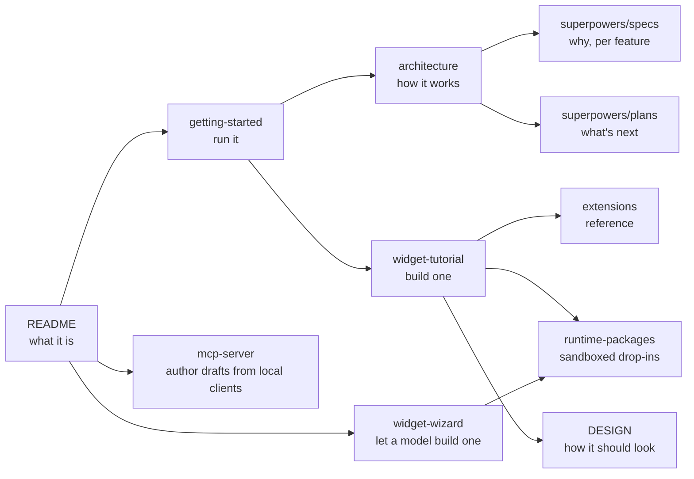

# Kavibay docs

## Guides

| Doc | For |
|---|---|
| [getting-started.md](getting-started.md) | Toolchain, first run, every command, troubleshooting |
| [architecture.md](architecture.md) | Window, click-through, palette, host, sandbox, credentials, invariants |
| [widget-tutorial.md](widget-tutorial.md) | Hello world in tiers S, M and L |
| [widget-wizard.md](widget-wizard.md) | Generating a widget with a model, and the limits it runs under |
| [mcp-server.md](mcp-server.md) | Enabling the embedded local authoring MCP server and its draft workflow |
| [extensions.md](extensions.md) | First-party extension reference: manifest, persistence, actions, credentials |
| [runtime-packages.md](runtime-packages.md) | Sandboxed packages: bridge, storage, declared HTTP, limits |
| [contract-packages.md](contract-packages.md) | Sandboxed packages that read from a connected provider: manifest, permissions, and the rules that fail silently |
| [extension-host.md](extension-host.md) | The contract-based extension system: layout, boundaries, phase state |
| [provider-schema.md](provider-schema.md) | **Generated.** What every shipping provider's queries take and return |
| [DESIGN.md](DESIGN.md) | Colour, type, spacing, dropdowns — the house style |

Two more live outside this folder:

- [../extensions/README.md](../extensions/README.md) — the catalogue of the 30
  built-in widgets, with tier and what each one needs.
- [../AGENTS.md](../AGENTS.md) — conventions and invariants for contributors and
  coding agents; the short version of `architecture.md`.

## Reference material

`superpowers/` is the project's paper trail. It is not tidied-up documentation —
it is what was decided and why, dated, at the time it was built.

| Folder | Holds |
|---|---|
| [`superpowers/specs/`](superpowers/specs) | One design doc per feature: the contract, the alternatives, the trade-off that was taken |
| [`superpowers/plans/`](superpowers/plans) | Phased implementation plans, marked done as phases land |

The two that outrank everything else when they disagree with a guide:

- [`specs/2026-07-18-extension-system-design.md`](superpowers/specs/2026-07-18-extension-system-design.md)
  — the canonical extension contract.
- [`specs/2026-07-22-runtime-extensions-design.md`](superpowers/specs/2026-07-22-runtime-extensions-design.md)
  — the sandbox threat model.
- [`specs/2026-08-01-declarative-http-api-design.md`](superpowers/specs/2026-08-01-declarative-http-api-design.md)
  — declared endpoints, end to end.

[../PLAN.md](../PLAN.md) is the original V1 specification, kept for the record.
Its file paths predate the repo restructure — read `architecture.md` for the
current layout.

## Note on `runtime-packages.md`

That file is also the **Widget Wizard's system prompt**:
`src-tauri/src/wizard/prompt.rs` embeds it verbatim with `include_str!`. Editing
it changes what the wizard's model is told, which is the point — a second,
hand-maintained copy of the format could never stay in sync. Write it for both
readers.

[contract-packages.md](contract-packages.md) is embedded the same way, as the
prompt for the other format. Two separate prompts rather than one document with
two halves: the formats disagree about nearly everything a model has to get
right, and a prompt carrying both produces hybrids that load as neither.

## Licensing

Everything in `docs/` is CC-BY-4.0 — see [LICENSE](LICENSE).
