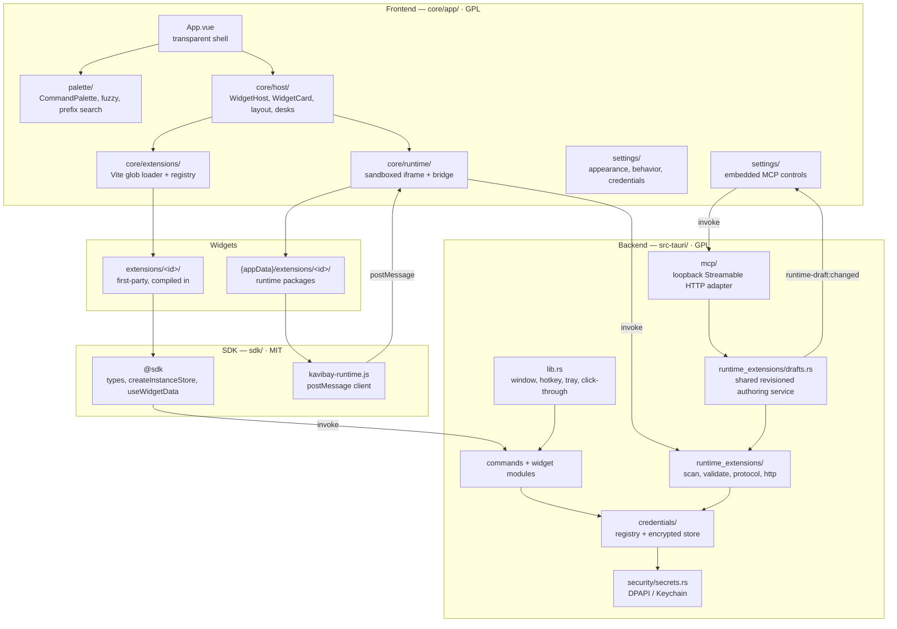
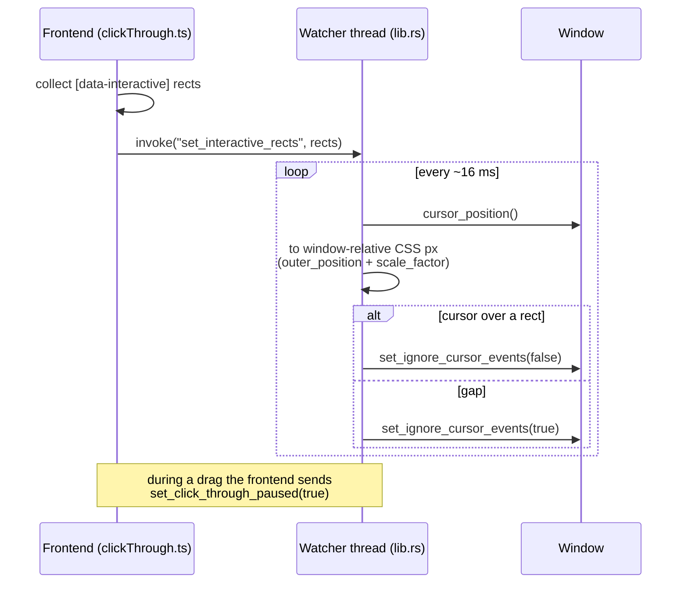
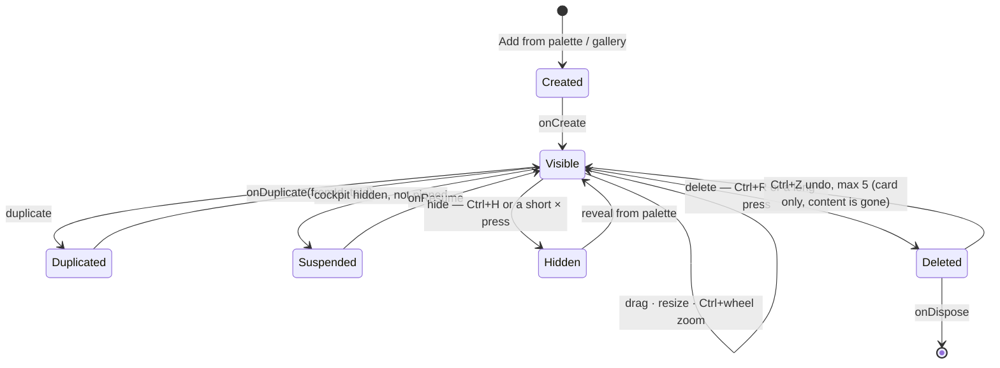
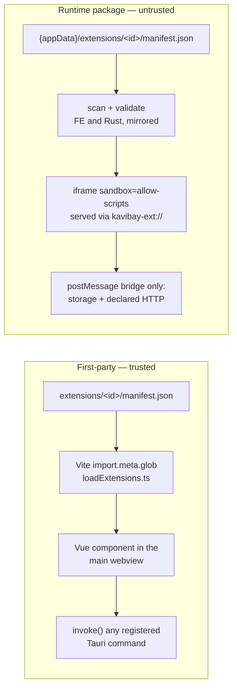
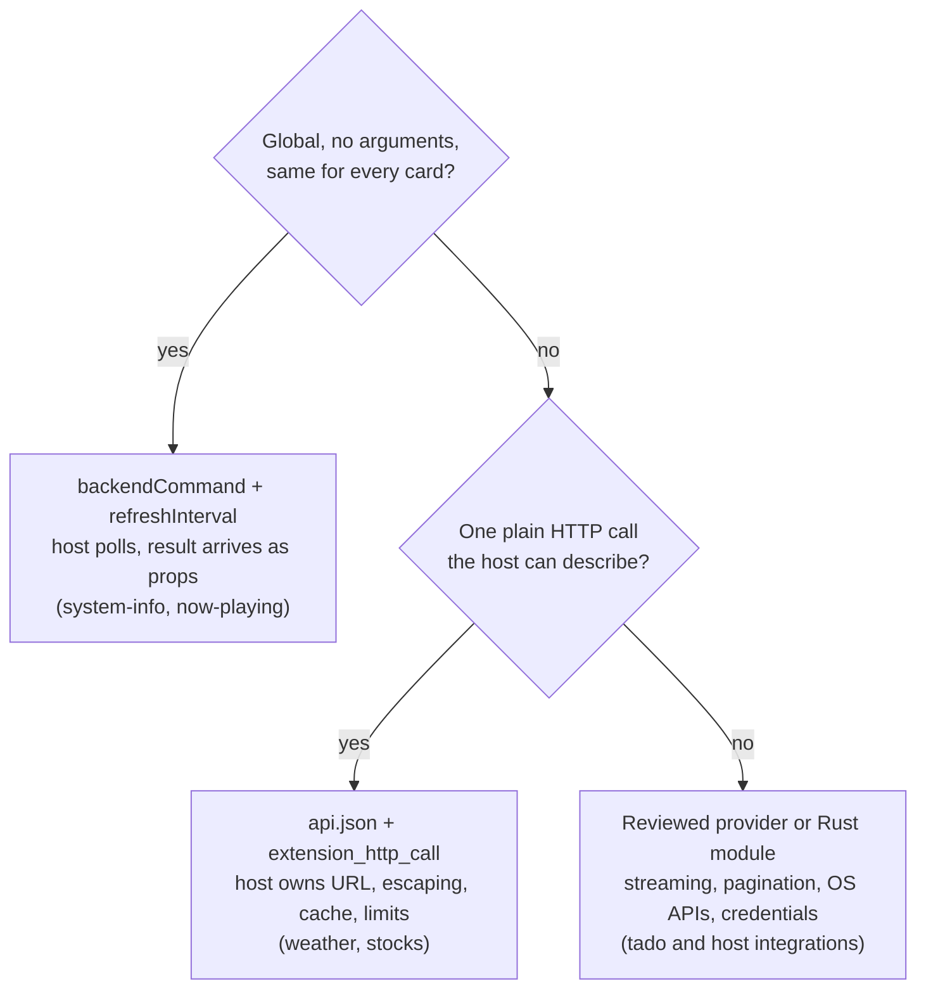
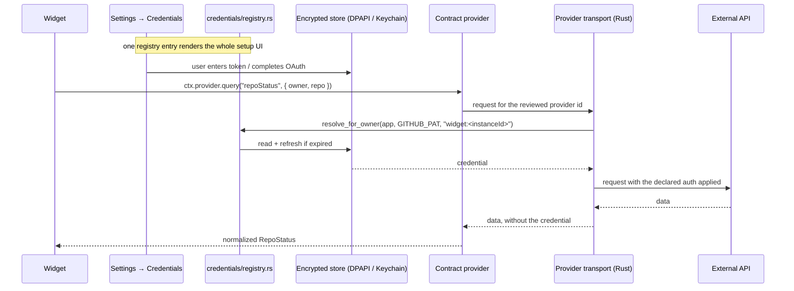

# How Kavibay works

A tour of the moving parts, from the window Windows draws to the sandbox a
community widget runs in. Read this before changing anything structural;
[../AGENTS.md](../AGENTS.md) has the short version plus the invariants.

## The layers



Folders are license boundaries, and the arrows respect them: `sdk/` never
imports from `core/` or `extensions/`, and an extension imports only its own
folder, `@sdk`, `vue` and `@tauri-apps/*`.

### Embedded authoring MCP

The optional server is part of the existing Tauri process. Settings persists
its enabled state and port in the backend-owned `settings.json`; the lifecycle manager
starts and stops one listener bound to `127.0.0.1:<port>/mcp`. There is no
sidecar executable, STDIO child process, background service or second runtime.

The server is an adapter, not a second implementation of package authoring.
Its nine reviewed tools call the same revisioned service used by the Widget
Wizard, so path validation, text/file limits, staging, validation and
`draft_conflict` semantics are shared. A successful write publishes a complete
draft tree and emits `runtime-draft:changed`; an open Wizard applies a clean
external revision or presents an explicit Reload/Keep conflict.

For a widget already in the palette, `checkout_custom_widget` verifies the
saved widget's content revision and copies it into `.drafts/<id>`. This gives
MCP the same edit surface without allowing it to replace a live widget; the
Wizard remains the only promotion path.

Each MCP request can carry the protocol handshake's advisory `clientInfo.name`.
Known Codex/Claude names are stored beside the draft (outside its content
revision), included as `lastClient`/`lastClientName` event metadata and rendered
with the corresponding Wizard mark. The Wizard shows the exact sanitized name
on hover, while unknown or omitted names remain generic MCP in visible labels.
Draft-scoped tool calls additionally update an in-memory presence book and emit
`runtime-draft:presence`. Active requests are exact; finished requests remain
visible for 60 seconds as recent activity, then expire without touching disk.

The service boundary is intentionally narrow. MCP can read authoring guides,
provider schemas, custom widgets and drafts, and can write/validate drafts. It
cannot access credentials, resolved provider state, runtime HTTP calls,
arbitrary Tauri commands, Wizard conversations, promotion, enabling or delete
operations. Runtime packages remain sandboxed exactly as described below; this
server does not widen their iframe or postMessage capabilities.

## The window

One window, `label: "main"`, created hidden and never destroyed
(`src-tauri/tauri.conf.json` + `src-tauri/src/lib.rs`):

```json
{ "visible": false, "decorations": false, "transparent": true,
  "alwaysOnTop": true, "skipTaskbar": true, "resizable": false, "shadow": false }
```

- **Not `fullscreen: true`.** Exclusive fullscreen fights with transparency.
  Rust reads `current_monitor()` in `setup` and applies `set_size` +
  `set_position` in physical pixels.
- **`shadow: false`** matters on Windows: otherwise DWM draws a drop shadow
  around the invisible fullscreen rectangle.
- **Hidden, not closed.** The hotkeys and the tray only call `show()` / `hide()`,
  so opening the palette never pays a startup cost.
- **The hotkey lives in Rust** (`tauri-plugin-global-shortcut`) and reacts only
  to `ShortcutState::Pressed` — otherwise it fires twice. On show it emits
  `palette:show`, and the frontend clears and focuses the search input.
- **Hold-to-peek is the exception** that wants both halves. `Ctrl+Space` emits
  `cockpit:peek` on press *and* release; Rust only ever shows the window, and the
  host decides what the release means (`core/app/host/peekSession.ts`), because
  whether the window may hide again depends on pinned widgets.
- **The toggle is not a shortcut at all.** Two taps on `Ctrl` cannot be
  registered: every platform's hotkey API wants modifiers *plus* a key, so a bare
  modifier is not expressible and "twice quickly" is not a concept it has.
  `src-tauri/src/ctrl_double_tap.rs` reads it from a `WH_KEYBOARD_LL` hook on
  Windows — which is also why it is Windows-only, and why `Shift+Ctrl+Space`, the
  tray and `kavibay --toggle` stay the way in everywhere else. The hook keeps two
  timestamps and no key identity, and always calls `CallNextHookEx`, so it never
  swallows a keystroke.
- **…and it takes two halves to be one toggle.** Windows stops calling that hook
  while our own webview has the keyboard focus, so it can open the cockpit but
  never close it: the closing keys are delivered to the webview instead. The same
  rule therefore runs again in `core/app/host/ctrlDoubleTap.ts`. The two cases are
  disjoint by construction — the webview only receives these keys while it has the
  focus, which is precisely when the hook is blind — and both end in
  `toggle_cockpit`, so there is still exactly one toggle.
  If a future change makes one side alone look sufficient, this is the paragraph
  that explains why it is not — the symptom is "opens fine, never closes", and it
  costs a day to rediscover.

### Click-through: the frontend reports, Rust decides

`set_ignore_cursor_events(true)` applies to the *whole* window. Once it is on,
the webview stops receiving mouse moves — it could never notice the cursor
coming back onto a card. So the detection has to run in the backend.



Cards and the palette mark themselves `data-interactive`; the shell and host
containers are `pointer-events: none` so the webview does not swallow clicks in
the gaps either. State is only switched on a change, not every frame.

## The command palette

`core/app/palette/` — a search input over several row kinds:

| Row kind | Comes from | `Enter` does |
|---|---|---|
| Command | `commands.ts` (static list) | `execute_action` in Rust, or a direct `invokeCommand` |
| Widget type | The extension registry | Give it a card on the desk (`Ctrl+Enter` opens it inline) |
| Widget instance | The current desk | Show / focus its card (`Ctrl+Enter` opens it inline) |
| Installed app | `installed_apps.rs`, indexed at startup | Launch it |
| Path | `pathQuery.ts` + `path_completions.rs` | Open it |

`fuzzy.ts` is a hand-written subsequence matcher with a score (bonus for word
starts and runs) — deliberately no dependency: small, readable, and it is the
kind of thing worth having read once.

**Prefixes** short-circuit the search: `g <term>` / `google <term>` opens a
Google search, `f <term>` opens Windows Search.

**The panel below the search field has three modes.** Normally it lists rows.
The two empty-query browse views (`←` for the widget inventory, `↓` for recent
runs) keep the same rows behind a fixed header with a Back button. `Ctrl+Enter`
on a widget or catalog row switches to the third: `InlineWidgetBody.vue` renders
that widget *in the panel*, in the box the list would have occupied, with its
title in the same header. It is not a card — no drag, no resize — and opening it
never changes the desk: a Hidden widget stays hidden, and nothing is added.

`Enter` — and a click, which is the same path — is the plain one: it gives the
widget a card (`runTypeRow` / `focusWidgetRow`), which is also what the Gallery
and the `+ Widgets` menu do, so the onboarding tour keeps its route. The two keys
used to be swapped for catalog rows and not for instance rows, which meant `Enter`
on a *New Timer* row and `Enter` on the Timer right above it did opposite things.

The two surfaces swap in both directions. Every card's ⋯ menu carries **Move to
main panel** (`onMoveToPanel`): the instance is hidden — the existing way to give
up a card without ceasing to exist — and the palette takes it over via the
`inlineWidgetRequest` ref, a typed channel in the same spirit as `widgetsMenuUi`.
Hiding suspends a widget, so the host resumes it immediately: it is going off the
desk, not off screen.

Double-clicking the panel title renames the widget through `kavibayRenameWidget`,
the same catalog write a card's title does. Scratch copies have no catalog entry,
so they do not offer the gesture.

The inline header's ↗ button (`popOutInlineWidget`) promotes the view to a real
card. For an instance that is just the reveal-and-focus `Enter` already does;
a scratch copy has no card to reveal, so it gets one and its state **moves** with
it via `runDuplicateHook` + `onDispose` — the established way to copy and drop
per-instance state. A runtime package keeps its storage in Rust, out of reach of
those hooks, so its scratch copy is left intact rather than cleared after nothing
moved.

`Ctrl`+wheel (and trackpad pinch, which Chromium reports as the same event) zooms
the inline body just like a card's. The value lives in `inlineWidgetZoom.ts`, not
on the instance: scratch copies have no instance to write to, and the panel is a
different box from a card — a zoom that makes the panel readable should not
resize the card behind it. It opens at the widget's own zoom and diverges only
once the panel itself is zoomed.

Opening inline hands the caret to the widget's own entry point via the
`kavibay:focus-widget` request — the host asks, the widget decides (see
[extensions.md](extensions.md#entry-point-where-the-caret-goes)). Because one
instance can now be mounted twice, that request carries a **surface**
(`sdk/extension/widgetFocusRequest.ts`) so the desk card cannot answer a request
meant for the inline copy. A widget with nothing to type into ignores it and
focus stays in the search field.

Which widget a row resolves to lives in `inlineWidgetTarget.ts`:

- A row that owns an instance shows **that** instance. It is the same widget as
  the desk card (extension state lives in per-instance stores), so edits made
  inline are the card's edits.
- A catalog row has no instance, and cannot be given one: the layout has no home
  for an instance placed on no desk, because `purgeRedundantHiddenInstances`
  reads hidden-everywhere instances as leftovers and drops them on load. So the
  palette renders its **own scratch copy** instead, under the stable synthetic id
  `palette-inline:<typeId>`. It never enters the catalog, never appears in a
  widget list, and only its widget state persists — one scratch widget per type,
  so nothing accumulates. The trade-off is that content typed into the scratch
  copy of a type you do not own lives only behind `Ctrl+Enter` on that type; a
  first-class home for off-desk instances would need a layout-schema change.

**Actions** hang off a widget row. `Tab` opens argument chips, `Enter` runs the
handler declared in the extension's `index.ts`. The host resolves which instance
to act on first — visible one wins, else a hidden one is revealed, else a new
widget is created — which is why handlers must write to the **store**, not to a
mounted component. Details in [extensions.md](extensions.md#palette-actions).

## The widget host

`core/app/host/` owns layout and chrome and stays generic. Per-extension
behaviour arrives only through manifest `ui` flags and lifecycle hooks — **never
`typeId` switches in host code**.



`onSuspend` / `onResume` is how a widget stops polling while the desk is away —
a pomodoro deliberately ignores it and keeps ticking.

**Hide and delete are reachable from either surface.** `Ctrl+Tab` cycles focus
through the open cards (`widgetFocusCycle.ts`), `Ctrl+Alt+S` jumps back into the
palette search from wherever focus sits, and `Ctrl+W` / `Ctrl+H` / `Ctrl+R` act on
the palette's selected row while you are typing there, and on the card you are
working in otherwise. `Ctrl+S` pins that same card and `Ctrl+D`
duplicates it (skipped for types with `allowDuplicate: false`). `widgetCloseKeys.ts`
holds the rule that decides which — palette focus first, then the card owning
the DOM focus, then the card the host handed keyboard focus to, then the last
one clicked; `widgetChordTarget()` in `WidgetHost.vue` is the one caller every
card chord goes through. The host listeners run in the capture phase so a widget
that owns plain keys (Snake, Notes) cannot swallow the chord first.
`SettingsModal` handles `Ctrl+W` (and `Escape`) itself while Settings is open.
Holding `Ctrl` for 750ms on the palette or active card reveals the Pin/Hide and
desk chord hints; releasing it removes them again.
`Ctrl+Alt+Arrow` moves the active widget or palette by one `GRID_GAP` step, with
the palette preserving the widgets' absolute screen positions just like a plain
palette drag.

### Sizing

`ui.defaultSize` is the *first* guess only. Once a widget of some type has been
resized, the host remembers that size per `typeId`
(`kavibay:widget-type-size-v1`, `typeSizeMemory.ts`) and every later card of that
type opens at it. Same for `defaultOffset`, `defaultHideTitle`, `defaultScale`:
manifest values seed a new card, then everything is per-instance.

### Desks and persistence

State lives in `localStorage` under `kavibay:` keys — no database, no sync:

| Key | Holds |
|---|---|
| `kavibay:layout-v4` | Desks, placements, the widget catalog (v2/v3 are migrated on load) |
| `kavibay:widget-type-size-v1` | Remembered size per widget type |
| `kavibay:appearance-v1` | Colour mode, typeface, glass, radius, spacing |
| `kavibay:developer-v1` | Behavior toggles, incl. Developer Extensions |
| `kavibay:<extension-id>:<instanceId>` | Per-instance widget settings (`instanceStorageKey`) |

A desk is a named set of placements; the catalog of instances is shared, so the
same widget can appear on one desk or on all of them. `Ctrl+Shift+1…9` switches.

## Two kinds of extension



| | First-party | Runtime package |
|---|---|---|
| Lives in | `extensions/<id>/` in the repo | `{appData}/extensions/<id>/`, user-installed |
| Written in | Vue SFC + TypeScript | Plain HTML/CSS/JS, no build step |
| Loaded by | Vite glob at build time | Scan at runtime, `kavibay-ext://` protocol |
| Can call | Any registered Tauri command | Only the bridge: instance storage, declared endpoints |
| Network | Declared endpoint or a Rust module | Declared endpoints only (`connect-src 'none'`) |
| Credentials | Resolved in its Rust module | **Never** — the validators reject the field |
| Trust | Ships with the app | Assumed hostile |

Folder name **must** equal `manifest.id` in both cases. There is no registry file
to edit anywhere.

## Getting data

Three paths, in order of how much machinery they cost:



The declared-endpoint path exists so a widget that just needs JSON never touches
the CSP or writes Rust. The host pins the vetted address, refuses redirects and
private ranges, percent-encodes every argument, and enforces a 10 s timeout, a
1 MiB cap and per-day quotas — see
[runtime-packages.md](runtime-packages.md#network-declare-dont-fetch) and
[extensions.md](extensions.md#declared-http-endpoints).

Instance-bound data (a zone, a repo, a stream) belongs in a Contract provider
query and is subscribed to from the widget's effect scope; `useWidgetData` is
only for widget-owned persisted data and not a network cache.

## Credentials

Extensions never store, decrypt, or receive a secret.



Adding an integration is one entry in `src-tauri/src/credentials/registry.rs`
(fields, auth kind, how the secret is injected, optional connection test) plus
`"credentials": [{ "type": …, "required": true }]` in the manifest. No
per-integration settings panel, no per-integration table.

A type may hold several **connections** — Linear issues one API key per
workspace, so "connected to Linear" is a fact about one widget instance, not
about Linear. `credentials/bindings.rs` stores which connection each consumer
picked, keyed by `(owner, typeId)`; `resolve_for_owner` reads that binding and
`resolve_for_connection` takes an explicit id plus a type check. There is no
resolution by type alone, so a deleted connection surfaces as "choose one"
rather than quietly resolving to whichever account is left. Cache identity on
the JS side carries the connection id and its revision, which is what lets two
widgets on one desk show two workspaces and still share one request when they
are on the same account (`core/app/extension-host/two-connections.assert.ts`).

## Security invariants

These hold even when a task looks easier without them:

1. `RuntimeExtensionFrame.vue` keeps `sandbox="allow-scripts"`. **Never** add
   `allow-same-origin` — guarded by `scripts/runtimeSandboxGuard.assert.mjs`.
2. The bridge trusts only host-side frame identity; `extId` / `instanceId` in a
   payload are ignored by design.
3. Every path derived from a package or manifest goes through `safe_join`
   (`runtime_extensions/validate.rs`). Fail closed.
4. Manifest and permission validation is **mirrored** in the frontend
   (`core/runtime/manifestValidate.ts`) and Rust — change both or neither.
5. Secrets only through `security/secrets.rs`. Never plaintext at rest, never in
   `localStorage`, never returned to the frontend.
6. The main-window CSP in `tauri.conf.json` gets no new entries without
   maintainer review. Prefer a Rust command or a declared endpoint.
7. Powerful commands (`launch_path`, `send_virtual_key`, clipboard) are
   acceptable *only* because the main webview runs first-party code exclusively.
   They are never exposed to runtime packages.

`examples/ipc-probe/` and `examples/http-probe/` exist to prove points 1–3 on a
real machine: install them and every row must read **PASS** / **BLOCKED**.

## Where to look next

| Question | File |
|---|---|
| How do I write a widget? | [widget-tutorial.md](widget-tutorial.md) |
| What can a manifest declare? | [extensions.md](extensions.md) |
| What can a sandboxed package do? | [runtime-packages.md](runtime-packages.md) |
| What should it look like? | [DESIGN.md](DESIGN.md) |
| Why is it built this way? | `superpowers/specs/` — one design doc per feature |
| What is being built next? | `superpowers/plans/` |
