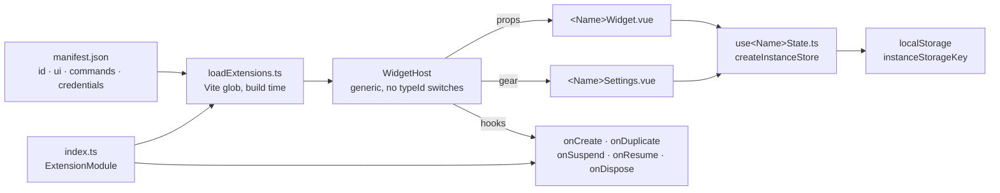

# Adding an extension

The **reference** for first-party extensions under `extensions/<id>/`: what a
manifest may declare, how per-instance state is stored, how palette actions and
credentials work. For a walkthrough that starts from an empty folder, read
[widget-tutorial.md](widget-tutorial.md) first.

The host discovers folders automatically — do **not** register them in a barrel file.

## Quick start (Tier S — client-only)

1. Create `extensions/<id>/` with `manifest.json`, `index.ts`, and `<Name>Widget.vue`.
2. Folder name **must** match `manifest.id`.
3. Clone `extensions/calculator/` for a minimal example.
4. Restart / reload the app — the widget appears in the palette.

Agent workflow (tiers S / M / L, checklists): `.cursor/skills/kavibay-widget/`.  
Canonical contract: `docs/superpowers/specs/2026-07-18-extension-system-design.md`.

## Layout

```
sdk/extension/         # types, createInstanceStore, instanceStorageKey, useWidgetData (@sdk)
core/app/extensions/   # loadExtensions, registry
core/app/host/         # WidgetHost, chrome
extensions/<id>/       # one folder per widget
```



### Lazy views (heavy widgets)

`loadExtensions.ts` globs every `index.ts` eagerly, because the palette needs all
metadata, actions, and lifecycle hooks up front. That means anything your
`index.ts` imports statically lands in the startup chunk and is parsed at launch
— even for a widget the user never opens.

So import the *view* dynamically when it is heavy, and keep the rest eager:

```ts
const extension: ExtensionModule = {
  component: defineAsyncComponent(() => import("./NotesWidget.vue")),
  menuComponent: defineAsyncComponent(() => import("./NotesMenu.vue")),
  // Composables, logic, and hooks stay static: actions must work without a
  // mounted widget (see "Write to the store, not the component").
  onDispose: (instanceId) => disposeNotesState(instanceId),
};
```

Use it when the component pulls a third-party dependency (`notes` → TipTap is
439 kB on its own) or renders a large tree. Skip it for small widgets — a chunk
per trivial view just adds requests. Never make the state composable lazy.

`hugHeight` widgets are the one exception: they measure their content to size the
card, so a view that mounts a frame late can settle at the wrong height. Keep
those static.

## Manifest layout and sizing

Every first-party extension declares `ui.defaultSize: { w, h }` in `manifest.json` — CSS pixels, required. The host applies width and height when you Add a widget from the palette or gallery.

`ui` also carries the rest of the state a new card opens in — the same things you can change by hand afterwards, so a widget starts where it should instead of needing the same two adjustments every time:

| Field | Default | Effect on Add |
|-------|---------|---------------|
| `defaultOffset: { x, y }` | required | Spawn position relative to the palette (halved on the way, then de-overlapped and grid-snapped) |
| `defaultSize: { w, h }` | required | Card size in CSS px |
| `defaultHideTitle` | `false` | `true` opens without the title bar — the context menu still brings it back |
| `defaultScale` | `1` | Content zoom, the same factor **Ctrl + mousewheel** writes. Clamped to `0.5`…`3`; out-of-range values clamp rather than fail the load |

One more field is not per-instance, because it is not a starting state:

| Field | Default | Effect |
|-------|---------|--------|
| `opaque` | `false` | `true` draws the card on an opaque ground instead of the shared glass, whatever **Appearance → Surface opacity** is set to |

Use it for a widget that is a workspace rather than a reading. The Widget Wizard
declares it: it holds a file editor, a transcript and a live preview of a
*different* widget side by side, and dense text in three columns over a wallpaper
and whatever cards are behind it is not a taste question. The preview is the
sharper half of the argument — a widget being judged has to be judged against a
plain ground, not against the desk showing through it.

It is deliberately unreachable from a runtime or contract **package** manifest,
like every other `ui` flag: `bundledExtensions.ts` reads it from an extension
compiled into the binary, and the package paths in `cockpit.ts` set it to
`false` outright. A drop-in that could turn the glass off would be overruling a
preference the user set, not declaring a property of itself.

All four sizing fields are per-instance from then on: moving, resizing, zooming or toggling the title writes to that instance's layout entry and the manifest is not consulted again.

**`defaultSize` is a first guess, not a fixed size.** Once a widget of some type has been resized, the host remembers that size per `typeId` (`kavibay:widget-type-size-v1`) and the next widget of the same type opens at it — the manifest value only applies to a type nobody has resized on this machine yet. So pick a size that reads well on first add and do not treat it as the size users will see. `hugHeight` docks remember width only. See `core/app/host/typeSizeMemory.ts`.

```json
"ui": {
  "defaultOffset": { "x": 0, "y": 0 },
  "defaultSize": { "w": 240, "h": 200 },
  "defaultHideTitle": true,
  "defaultScale": 1.25
}
```

Runtime packages read the same four fields (`docs/runtime-packages.md`).

Optional `intro.mp4` beside `manifest.json` (`extensions/<id>/intro.mp4`) includes the extension as a tile in the **Widget Gallery** desk widget (`extensions/gallery/`). No video → no gallery tile. The Gallery itself is a normal first-party widget (move / resize / pin); first-open starts the guided tour, while the user opens Gallery through the palette's Widgets list or the `open-gallery` command. It ships no `intro.mp4` and never appears as a tile in itself. Tile frames use **4:3** (`aspect-ratio: 4 / 3`) to match 640×480 intros.

### Catalog icon

Declare a package-relative icon for the **Widgets** menu and palette type rows:

```json
"icon": "icon.svg"
```

| Rule | Detail |
|------|--------|
| File | Prefer `icon.svg` (mono stroke, black on transparent). `icon.png` allowed. |
| Manifest | Required path relative to the extension folder — do not embed SVG in JSON. |
| Missing | Host shows a generic widget mark. |
| Runtime packages | Same field; served via `kavibay-ext://<id>/<icon>` after scan. |

Host resolves first-party icons at load time (`loadExtensions.ts`); unsafe paths (`..`, absolute) are ignored.

When `ui.hugHeight: true`, height follows widget content; only `defaultSize.w` is applied on Add (`defaultSize.h` is ignored for sizing).

## Persistence (new extensions)

Use the canonical key helper:

```ts
import { instanceStorageKey } from "@sdk/instanceStorageKey";

instanceStorageKey("my-widget", instanceId); // → kavibay:my-widget:<instanceId>
```

Legacy keys (`kavibay:notes-widget:…`, `kavibay:foo-v1`, etc.) stay as-is — do not migrate unless needed.

For per-instance settings/state + duplicate/dispose, prefer `createInstanceStore` (see `clock` / `weather`):

```ts
import { createInstanceStore } from "@sdk/createInstanceStore";

const store = createInstanceStore<MySettings>({
  load: loadMySettings,
  save: saveMySettings,
  normalize: normalizeMySettings,
});

export function useMySettings(instanceId: string) {
  const { state: settings, update } = store.use(instanceId);
  return { settings, update };
}

export const disposeMySettings = store.dispose;
export const seedMySettingsFrom = store.seedFrom;
```

Wire `onDuplicate` → `seed…From`, `onDispose` → `dispose…` + `clear…` in `index.ts`.

## Entry point (where the caret goes)

A widget that has somewhere to type declares it by answering the host's focus
request. The host never knows which control that is — it only asks:

```ts
import { inject } from "vue";
import { WIDGET_FOCUS_EVENT, widgetFocusRequestMatches, type WidgetSurface } from "@sdk";

const widgetSurface = inject<WidgetSurface>("widgetSurface", "desk");

function onKavibayFocusWidget(event: Event) {
  if (!widgetFocusRequestMatches(event, instanceId, widgetSurface)) return;
  focusMyInput(); // your call: Notes focuses the editor, Todo the first empty row
}

onMounted(() => window.addEventListener(WIDGET_FOCUS_EVENT, onKavibayFocusWidget));
onBeforeUnmount(() => window.removeEventListener(WIDGET_FOCUS_EVENT, onKavibayFocusWidget));
```

The entry point can be computed, not just a fixed element — `time-tracker` creates
a task when there is none, `todo` picks the first empty row.

**Always pass the surface.** One instance can be mounted twice at once: as a card
on the desk and in the palette's inline view (`Ctrl+Enter` on a palette row). Both
copies hear the same window event, so a request must be answered only by the copy
it was aimed at — otherwise the card behind the palette steals the caret. An
omitted surface means `"desk"`, which is what a host that predates inline views
sends. Widgets with nothing to type into (`clock`, `weather`) simply do not
listen; focus then stays in the palette search field, ready for the next query.

Sandboxed runtime packages get no DOM event — the host focuses their iframe and
the page decides where the caret lands inside it.

## Backend data

- **`backendCommand` + `useWidgetData`**: global poll, no args — fits `system-info` / `now-playing`.
- **Instance-bound APIs** (zone id, repo): do **not** use `useWidgetData`. Put the
  request in a Contract provider query and subscribe from the widget's effect
  scope (see `tado`, `github`).

Declare Tauri command names in manifest `commands`. Register Rust modules in `src-tauri/src/lib.rs` (still manual).

## Palette actions

An **action** lets the palette do something to your widget without opening it:
find your extension, press `Tab`, type `1h`, press `Enter`. Metadata goes in the
manifest, the handler in the extension definition. Legacy extensions keep the
handler in `index.ts`; Contract extensions put it in the widget definition.

Your extension keeps **one** palette row — the action does not add a second one.
It hangs off that row (`Tab`), and its title and keywords make the row findable,
so `countdown` or `set timer` also lands on Timer. Only the **first** declared
action is reachable today; a picker for more is not built yet. `Tab` on a row
with an action no longer jumps focus into the widget.

> `manifest.actions` is unrelated to `manifest.commands` — the latter lists
> **Tauri command names** your Rust side registers.

```json
"actions": [
  {
    "id": "set-timer",
    "title": "Set Timer",
    "subtitle": "Start a countdown",
    "keywords": ["countdown", "start"],
    "params": [
      { "name": "duration", "type": "text", "required": true,
        "placeholder": "Duration (25m, 1h30)" }
    ]
  }
]
```

```ts
const extension: ExtensionModule = {
  component: TimerWidget,
  actions: {
    "set-timer": ({ instanceId, args }) => {
      const ms = parseCustomDuration(args.duration ?? "");
      if (ms == null) throw new Error("unparsable duration"); // palette stays open
      const state = useTimerState(instanceId);
      state.reset();
      state.setCustomDuration(ms);
      state.start();
    },
  },
};
```

**Parameters.** `type` is `text`, `number`, or `enum` (with `options`, matched
case-insensitively — the handler receives the canonical option). Optional params
that are left blank are **absent** from `args`, not `""`. Several params render as
several chips; `Tab` cycles, `Shift+Tab` goes back, `Escape` drops them. An action
without `params` runs straight from `Enter`.

To grow extra chips from what the user just typed (a `{name}` in a snippet
template), export `dynamicActionParams(actionId, values)` from `index.ts`. The
palette calls it on every keystroke and renders whatever param list you return;
the manifest `params` stay the fallback and the searchable catalog shape.

**The subtitle is the row's second line.** A type row normally reads `WIDGET`
under its name — a category the icon and the Open button already give away. An
extension that declares an action replaces it with that action's `subtitle`, so
the one descriptive line a row has says what pressing it does. Set in normal
case there, because it is a sentence rather than a category word.

**A widget action is not reachable from the catalog row.** The palette runs a
type row by *opening the widget*; the action attached to it only feeds that
row's keywords, so its handler never runs from there. Widget actions are reached
from an **instance** row (Tab → chips). An action that must be runnable from a
bare query needs `"needsInstance": false`, which gives it a row of its own — and
then opening a card, if it wants one, is the handler's job.

**`"replacesCatalogRow": true`** drops the extension's catalog row from search
results while the action's own row is in them. For the Widget Wizard the two
rows said the same thing — "New Widget" opens the Wizard *and* starts a project,
"Widget Wizard" only opens it — so the second was noise.

Declared rather than inferred from `needsInstance: false`, because the two do
not imply each other: Snippets' "Expand Snippet" wants no instance and never
opens the card, so its catalog row is the only way to add the widget. Scoped to
search results and to results that actually contain the action row — the **+**
menu and the gallery build their lists from the catalog directly and keep every
widget addable.

`needsInstance: false` works on a widget extension too. It used to not: the
palette built those rows only from extensions with no widget card, which
conflates whether the *extension* has a card with whether the *action* wants
one. Such an action was unreachable rather than misplaced — there is no instance
row for an action that asks for no instance. Snippets' "Expand Snippet" was
declared that way and unreachable for as long as it has existed.

**Which instance?** The host resolves one before calling you: a visible instance
wins, else a hidden one is revealed, else a new widget is created. Set
`"needsInstance": false` for an action that touches no widget — you then get an
empty `instanceId`. Action-only extensions (`ui.widget: false`) skip the widget
catalog entirely and show as their own palette row — `confetti` and `kill-port`.

**Write to the store, not the component.** Because the host may have just created
the widget, the handler can run *before* anything mounts. Per-instance state lives
in the module-level cache (`use*State(instanceId)` / `createInstanceStore`), which
the component reads when it mounts — so writing there works either way. A handler
that assumes a mounted component will silently do nothing on a fresh widget.

**Failure.** Throwing (or returning a rejected promise) is the way to say "bad
input": the palette logs it, stays open, and keeps the query. An action declared
in the manifest without a matching handler is dropped with a console warning, so
it can never appear as a dead row.

Runtime (sandboxed) packages cannot declare actions yet — the postMessage bridge
has no host-initiated invoke.

## Selection quick actions (Ctrl+Shift+Q)

A **text action** transforms text the user selected in *any* application. Press
`Ctrl+Shift+Q` with something selected, pick a row from the popup, and the answer
replaces the selection.

Same split as palette actions: metadata in the manifest, handler in `index.ts`.

```json
"textActions": [
  { "id": "translate", "title": "Translate", "subtitle": "German ↔ English" },
  { "id": "correct-grammar", "title": "Correct grammar" }
]
```

```ts
const extension: ExtensionModule = {
  component: MyWidget,
  textActions: {
    translate: async ({ text, signal }) => rewrite(TRANSLATE_PROMPT, text, signal),
  },
};
```

The handler gets the selection and an `AbortSignal`, and resolves with the
replacement text. An optional `onChunk` callback receives incremental pieces
when the handler streams; the popup uses that to render the answer as it
arrives. Rejecting shows the message in the popup and leaves the user's
selection alone — so a failure is never pasted.

**Where the answer goes.** The host pastes only into a control it positively
identified as a text field — a system caret, or a UI Automation element that
takes text. Everything else, *including anything it could not identify*, gets
the answer on the clipboard, and the popup says so before the user picks a row.
The two mistakes are not symmetric: a needless Ctrl+V costs a keypress, a
mistaken one fires a keystroke into whatever has focus. Handlers see none of
this — they get text and return text either way.

**No instance, no widget.** The popup is its own window
(`core/app/quickaction/`) and it mounts no widget host: there is no
`instanceId`, and per-instance state does not exist. Anything the handler needs
must come from the manifest, from a Tauri command, or from a constant. That is
why `one-purpose-llm` uses its *shipped* system prompts here rather than a
prompt someone edited inside a widget card.

**Cost of the popup being separate.** It discovers actions from manifests only
and imports your `index.ts` lazily, when a row is picked (see
`core/app/extensions/textActions.ts`). Keep module-level work in
`index.ts` cheap — it is now on the path of a hotkey the user expects to be
instant.

**Which model?** For LLM-backed actions, read the host's quick-action model with
the `llm_quick_model` command (declare it in `manifest.commands`) instead of
picking one yourself. The user sets it once in **Settings → AI**.

The offerable models and their provider API IDs, context windows, token prices,
capabilities, and source links live in `src-tauri/src/llm/models.json`. Both
`llm_models` (enabled models for widgets) and `llm_catalog` (the full Settings
list) are built from that file. An extension that needs its own picker should
filter `llm_models` by provider instead of shipping another model array.

How the selection is captured and pasted back — foreground window, synthesised
`Ctrl+C` / `Ctrl+V`, borrowed clipboard — is documented in
`src-tauri/src/quick_action/mod.rs`. Windows only for now; the macOS port needs
the Accessibility API rather than a clipboard round-trip.

Runtime (sandboxed) packages cannot declare text actions.

### Standalone palette actions

Confetti and Kill Port are Contract extensions without a widget card. Their
manifest still declares the action metadata, but the handler is under
`contributes.actions` in `extension.ts` and must declare `needsInstance: false`.
The host exposes those actions as direct palette rows; it does not create a
placeholder widget instance.

## Credentials (API keys, OAuth accounts)

Extensions never store, decrypt, or receive a secret. They declare which
**credential type** they need; the host stores the values encrypted and the
integration's Rust module resolves them.

1. Add a credential type to `src-tauri/src/credentials/registry.rs` — fields,
   auth kind (`Static`, `OAuth2AuthCode`, `OAuth2DeviceCode`), how the secret is
   injected, optional connection test. That is the whole setup UI: **Settings →
   Integrations → Credentials** renders every registered type.
2. Declare the dependency in `manifest.json`:

```json
"credentials": [{ "type": "githubPat", "required": true }]
```

3. Resolve it in Rust, never in the widget:

```rust
let credential = credentials::resolve_for_type(&app, registry::GITHUB_PAT).await?;
let request = credential.apply(client.get(url))?; // injects the declared auth
```

`resolve_for_type` refreshes expired OAuth tokens on the way out, so integrations
never reason about expiry. It reports `not_configured` (show a setup state),
`needs_reauth` (prompt to reconnect), or a real failure.

Widget-side, only these read-only commands are available:

| Command | Use |
|---------|-----|
| `credentials_configured` | `typeId` → bool, for the "set this up" gate |
| `credentials_type_status` | state, account label, missing fields, pending flag |
| `credentials_connect` / `credentials_cancel_connect` | start/stop a sign-in from the widget |

Sandboxed runtime packages may **not** declare `credentials` — the manifest
validators reject it in both FE and Rust.

## Verify

- Pure helpers: `npx tsx path/to/file.assert.ts`
- `npx vue-tsc --noEmit`
- Manual: palette add, duplicate/dispose if stateful, settings if present

## Runtime packages (power users)

Writing one: **[docs/runtime-packages.md](runtime-packages.md)** — quick start,
declared endpoints, credentials, format versioning.
Architecture: [runtime extensions design](superpowers/specs/2026-07-22-runtime-extensions-design.md).
FE-only drop-in loading (P1). Packages with a native sidecar backend are rejected until a later release.

### Install a sample package

1. Copy `examples/runtime-extension-s/` to `{appData}/extensions/runtime-extension-s/`  
   (folder name must match `manifest.id`). On Windows, `{appData}` is typically  
   `%APPDATA%\com.aswetlow.kavibay\` (confirm via **Settings → Extensions → Runtime packages → Folder**).
2. Enable **Settings → Behavior → Developer Extensions**.
3. Open **Settings → Extensions**, scroll to **Runtime packages**, click **Rescan**.
4. Enable the package when status is `ready` (error rows cannot be enabled).
5. Add it from the command palette / Widgets list like a built-in widget.

Disable in the same list unloads it from the palette; package files stay on disk until you delete the folder yourself.

### Declared HTTP endpoints

A sandboxed package cannot `fetch` — its frame CSP is `connect-src 'none'`, and
that stays. Instead it declares endpoints in an `api.json` next to the manifest,
asks for the `network.declared` permission, and calls them through the host:

```json
{
  "schemaVersion": 1,
  "endpoints": [
    {
      "id": "forecast",
      "description": "Reads the current temperature for a location from Open-Meteo.",
      "method": "GET",
      "url": "https://api.open-meteo.com/v1/forecast",
      "query": {
        "latitude": { "type": "number", "required": true },
        "longitude": { "type": "number", "required": true },
        "current": { "type": "const", "value": "temperature_2m" }
      },
      "cache": { "ttlSeconds": 600 },
      "rate": { "minIntervalSeconds": 60 }
    }
  ]
}
```

Copy `sdk/runtime/kavibay-runtime.js` into the package and call it:

```js
const res = await kavibay.http("forecast", { latitude: 52.52, longitude: 13.405 });
if (!res.ok) return showError(res.code);
render(res.data.current.temperature_2m);
```

What the host guarantees, so the package does not have to:

| Rule | Detail |
|------|--------|
| Static target | scheme, host and port come from `api.json`; `{name}` placeholders fill **whole** path segments only |
| Encoded arguments | values are checked against the declared type/charset, rejected on traversal, then percent-encoded — `a?x=1` cannot open a query |
| No redirects | a 3xx comes back as `http_error`, so a redirect cannot reach a private address |
| No private network | resolved addresses in loopback/private/link-local/CGNAT ranges are refused, and the vetted address is pinned for the connection |
| Bounded | 10 s timeout, 1 MiB response cap, per-endpoint `minIntervalSeconds`, 500 calls/day per package |
| Visible | every endpoint's purpose, method and hosts are listed in Settings → Extensions before you can enable the package |

`credential` on an endpoint is accepted by the validator but not executed yet —
that lands with D2 of the design.

Full contract: [declarative HTTP design](superpowers/specs/2026-08-01-declarative-http-api-design.md).

### Install the declared-HTTP probe

Copy `examples/http-probe/` → `{appData}/extensions/http-probe/`, enable it, and
add it. It attempts nine breakouts against its own declaration — undeclared
endpoint id, undeclared argument, overriding a `const`, path traversal, a
separator inside a segment, a charset violation — plus one declared call as a
control. Expected output is **ALL BLOCKED** with the control succeeding. Any
`ESCAPED` row is stop-ship.

### Install the IPC isolation probe

Same steps as above, copying `examples/ipc-probe/` → `{appData}/extensions/ipc-probe/`.
No permissions requested. After enable + add, the widget must show **ALL PASS** (every
IPC/DOM check blocked). Any **FAIL** is stop-ship — see the runtime extensions design
spec (UI sandbox → threat model).
