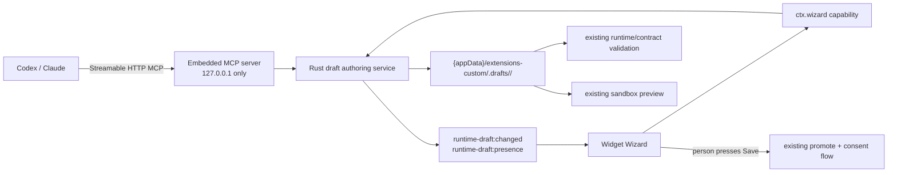

# Embedded Kavibay Authoring MCP Server

Date: 2026-08-22
Status: **M0–M9 done.**
Implementation model: **GPT-5.6 Luna**, one phase at a time, with the phase's
verification green before continuing.

**Goal:** let local MCP clients such as Codex and Claude author Kavibay widgets
through a server that is enabled in global Settings, while Kavibay remains the
only process, the existing draft workspace remains the source of truth, and an
open Widget Wizard reflects external draft changes immediately.

**Product sentence:** the agent writes a draft; Kavibay bounds and validates it;
the Wizard shows it; the person decides whether to save and enable it.

This is not "the Widget Wizard as MCP". The Wizard and MCP are two clients of
the same Rust authoring service. MCP contains no model call and does not expose
Wizard conversations.

## 1. Outcome



When complete:

- Settings → Integrations → MCP Server has a global off-by-default switch.
- Enabling it starts a Streamable HTTP MCP server inside `kavibay.exe`; there is
  no sidecar, CLI, service, or second executable.
- The server binds only to `127.0.0.1:<configured-port>` and stops with Kavibay.
- Codex or Claude can read the exact authoring guides, list/read drafts and
  custom widgets, write a complete draft file set, and validate it.
- An externally created draft appears in the Wizard's left column.
- An externally updated open draft refreshes Files, validation and preview and
  creates an `Updated via MCP` version checkpoint.
- Draft-scoped MCP calls show ephemeral active/recent client presence in the
  Wizard without claiming visibility into model work between calls.
- A local edit or running generation is never silently overwritten by an MCP
  write; stale writers receive `draft_conflict`.
- Promote, enable, delete, network probes, grants, credentials and model calls
  are not MCP tools in this phase.

## 2. Decisions and boundaries

| Decision | Reason |
|---|---|
| **Embedded Streamable HTTP**, not STDIO | STDIO requires the MCP client to launch another process. A loopback HTTP server can live in Tauri's existing Rust process and call the same services and event bus as the Wizard. |
| **Kavibay must be running** | The global switch and live Wizard synchronization only have meaning while the application owns the server. Autostart may improve availability later; it is not part of this feature. |
| **One Rust authoring service** | Tauri commands and MCP tools are adapters. Neither duplicates `safe_join`, file limits, format validation or root selection. |
| **Draft on disk is authoritative** | A Wizard conversation may refer to a draft, but it does not own it. MCP changes must survive the Wizard being closed and appear when it opens. |
| **Whole-file-set writes** | This matches `runtime_extensions_draft_write`. An omitted file is removed. The tool description must state this prominently; no speculative patch language is added. |
| **Optimistic revision check** | `expectedRevision` prevents a Wizard turn, hand edit and MCP client from overwriting one another with an older snapshot. |
| **No promote tool in MVP** | Saving is where Kavibay shows provider/network consent. Keeping it in the Wizard preserves a visible human decision and keeps the local server low privilege. |
| **No authentication in MVP, with a deliberately narrow capability set** | The server is loopback-only, rejects browser origins and exposes no authority beyond files the same OS user can already read/write under `extensions-custom`. Authentication becomes mandatory before adding promote, delete, endpoint calls, credentials or any non-loopback transport. This trade must be documented, not silently widened later. |
| **Fixed default port, user-editable** | A stable URL makes client setup one-time. Default: `43127`; a conflict is shown in Settings and never falls back silently to another port. |
| **No filesystem watcher for MCP writes** | MCP is in-process, so the authoring service emits after a completed write. A watcher for manual Explorer/editor changes is useful but separate scope. |

### Security invariants for this feature

1. Bind the listener to the parsed socket address `127.0.0.1:<port>`, never to
   `0.0.0.0`, `::`, a hostname, or a configurable host.
2. Require the request `Host` to match `127.0.0.1:<port>` and reject every
   request carrying an `Origin` header. Do not add permissive CORS headers.
3. Let the selected MCP transport handle its protocol methods, but enforce a
   small request body limit above the existing 2 MiB package maximum and a
   bounded number of concurrent requests.
4. Never accept an absolute path or root path from an MCP argument. Every MCP
   operation takes a validated package id and package-relative files only.
5. Keep the existing limits: 32 files, 512 KiB per file, 2 MiB total, and every
   output path through `safe_join`.
6. Read only the custom root. Installed/store/manual packages remain invisible
   to MCP source-reading tools, matching the Wizard's existing boundary.
7. MCP never receives secrets, resolved credentials, install grants, arbitrary
   Tauri commands or `runtime_extensions_http_call`.
8. `RuntimeExtensionFrame.vue` remains `sandbox="allow-scripts"`; this feature
   does not change CSP, runtime-package permissions, or the bridge.
9. Tool errors return stable codes such as `draft_conflict`, `invalid_package_id`
   and the existing validator codes. Logs must not contain file contents.
10. A later scope increase first adds authentication and a new reviewed plan;
    it must not be smuggled into a convenient extra MCP tool.

## 3. Public MCP contract

The server name is `kavibay-authoring`. Its initialization `instructions` must
put the important workflow in the first 512 characters:

> Read the authoring guide before writing. Write only complete file sets to a
> draft; omitted files are removed. Read the latest revision before updating and
> pass it as expectedRevision. Validate after every write. MCP cannot save,
> enable, delete, grant access, call widget endpoints or access credentials; ask
> the person to review and Save in Kavibay's Widget Wizard.

Use the current maintained Rust MCP SDK and its Streamable HTTP server transport.
Do not hand-roll JSON-RPC framing, session negotiation or protocol-version
handling. Resolve and pin the then-current compatible crate/features during M0;
do not copy a version number from this plan.

### Resources

Resources are backed by the same repository docs already embedded into the
Wizard prompt; they are not second copies.

| URI | Source |
|---|---|
| `kavibay://authoring/runtime-package` | `docs/runtime-packages.md` + `docs/DESIGN.md` through `wizard::prompt::system_prompt()` |
| `kavibay://authoring/contract-package` | `docs/contract-packages.md` plus selected provider blocks through `wizard::prompt::contract_system_prompt()` |
| `kavibay://authoring/provider-schema` | the generated/read-only provider schemas already offered to the Wizard |

Because clients differ in how readily they discover MCP resources, also expose
the first two through `get_authoring_guide`; it must call the same prompt
functions rather than maintain separate prose.

### Tools

| Tool | Annotation | Input | Result / rule |
|---|---|---|---|
| `get_authoring_guide` | read-only | `format`, optional provider ids | Exact host-owned authoring context. Unknown provider ids fail closed. |
| `list_widget_providers` | read-only | none | Provider ids and read-only schemas available to generated contract packages; no credential state or secret. |
| `list_drafts` | read-only | none | Sorted `{id, files, revision, error}` summaries. |
| `read_draft` | read-only | `id` | Complete text files, revision and current validation error. Binary/oversized content is refused by the existing caps. |
| `write_draft` | write, non-destructive outside the draft workspace | `id`, `expectedRevision: string \| null`, complete `files[]` | Creates only when no draft exists and expectation is null; updates only when the revision matches. Returns the new snapshot summary. |
| `validate_draft` | read-only | `id` | Runs the same runtime/contract scan used before promotion and returns its stable error code. |
| `list_custom_widgets` | read-only | none | Filtered custom-package metadata only: id, name, format and validation status; no local path or install grant. |
| `read_custom_widget` | read-only | `id` | Complete source plus a content revision, but only when the resolver says `PackageOrigin::Custom`. |
| `checkout_custom_widget` | write draft | `id`, `expectedRevision` | Copy a saved custom widget into a new draft only when the source revision matches; never replaces an existing draft or promotes the widget. |

Explicitly absent:

- `generate_widget` / model completion
- `promote_draft`, `enable_widget`, `set_grant`
- `discard_draft`, `delete_widget`
- endpoint/network calls
- conversation operations
- arbitrary path/file operations
- credential or model-provider state

## 4. Internal data contracts

Add these concepts beside the existing draft types in
`src-tauri/src/runtime_extensions/drafts.rs` (names may be adjusted to existing
Rust style, semantics may not):

```rust
pub struct DraftSnapshot {
    pub id: String,
    pub files: Vec<DraftFile>,
    pub revision: String,
    pub error: Option<String>,
}

pub enum DraftWriteOrigin {
    Wizard,
    Mcp,
}

pub struct DraftChanged {
    pub id: String,
    pub revision: Option<String>,
    pub kind: DraftChangeKind, // Written | Discarded | Promoted
    pub origin: DraftWriteOrigin,
}
```

Revision definition:

- SHA-256 over files sorted by normalized relative path.
- Hash `path length + path bytes + content length + content bytes`; do not rely
  on ambiguous separator concatenation.
- The same helper hashes a custom widget read from disk.
- Revision is content identity, not a timestamp and not a security token.

Write semantics:

1. Validate id and file limits before touching disk.
2. Read the current revision if the target exists.
3. `expectedRevision == null` succeeds only when no draft exists.
4. A supplied revision succeeds only on an exact match.
5. Mismatch returns `draft_conflict:<currentRevision>` without changing disk.
6. Write through a sibling staging directory; only publish a complete staged
   tree. On Windows, use a recoverable rename/swap sequence and clean stale
   staging/backup directories on the next operation.
7. Summarize/validate the published tree.
8. Emit one `runtime-draft:changed` event after publication; never emit for a
   rejected or half-finished write.

The existing Tauri command remains compatible at the TypeScript call boundary,
but it becomes a thin wrapper over this service and accepts the current optional
revision. All Wizard write paths are updated to pass it before strict
create/update semantics become mandatory.

## 5. Implementation phases

Each phase is sized for Luna: one bounded outcome, explicit files, and tests
before the next phase. Do not combine phases into one large edit.

### M0 — Transport spike and locked contract

- [x] Verify the current official MCP Streamable HTTP requirements and the
      maintained Rust SDK's server features at implementation time.
- [x] Add the smallest compatible MCP/server dependencies to
      `src-tauri/Cargo.toml`; reuse the existing Tokio runtime and do not add a
      second async runtime.
- [x] Record dependency purpose and license in the completion note. No SDK or
      extension code may depend on the transport crate.
- [x] Create `src-tauri/src/mcp/mod.rs` with only the server identity,
      instructions constant and module declarations.
- [x] Add an in-process protocol test that initializes a server and lists one
      placeholder read-only tool. This proves the selected transport before any
      product logic is built.
- [x] Stop if the SDK cannot enforce loopback HTTP, request limits or graceful
      shutdown without hand-written protocol code; revise this plan rather than
      silently falling back to an ad-hoc server.

Verification:

```bash
cargo test --lib mcp
cargo fmt --check
```

M0 completion note (2026-08-22): `rmcp 3.1.4` (Apache-2.0) is used with its
`server` and `transport-streamable-http-server` features; `axum 0.8.9` (MIT)
provides the in-process HTTP request/response harness for the protocol test.
The existing Tokio dependency is reused. The maintained transport exposes the
loopback Host allowlist, request-body limit and cancellation token needed by
later lifecycle work, so no JSON-RPC or session protocol was hand-written.
`cargo test --manifest-path src-tauri/Cargo.toml --lib mcp` passed (1 test) and
`cargo fmt --manifest-path src-tauri/Cargo.toml -- --check` passed. M1–M6 remain
intentionally untouched.

### M1 — Shared revisioned draft service

Primary files:

- `src-tauri/src/runtime_extensions/drafts.rs`
- `src-tauri/src/runtime_extensions/mod.rs`
- `src-tauri/src/lib.rs`
- relevant Rust `#[cfg(test)]` modules

Tasks:

- [x] Extract internal `list_drafts`, `read_draft`, `write_draft`,
      `validate_draft`, `read_custom_package` operations that take `&AppHandle`;
      keep Tauri commands as adapters.
- [x] Add `DraftSnapshot`, content revision calculation and a full-text
      `runtime_extensions_draft_read` command. Do not overload
      `runtime_extensions_read_package`, whose custom-root-only meaning is an
      important boundary.
- [x] Add `expectedRevision` to draft writes and update all current Wizard call
      sites before enforcing strict conflicts.
- [x] Stage and publish complete directory trees so a preview does not observe
      files arriving one by one. Preserve `safe_join` for every staged path.
- [x] Add the origin-aware change event after successful write, discard and
      promote operations. Events contain ids/revisions only, never file bodies.
- [x] Preserve all existing error codes and add `draft_conflict` and recovery
      errors without turning validation failures into generic strings.

Rust tests:

- [x] revision is stable across file ordering and changes on path/content edits
- [x] create with null expectation, matching update, stale update refusal
- [x] rejected conflict leaves every byte unchanged
- [x] staged write failure restores or retains the previous complete draft
- [x] stale staging/backup cleanup cannot escape `.drafts`
- [x] full draft read enforces file count/size/text/path rules
- [x] custom read still refuses installed origin
- [x] runtime and contract drafts return the same validation verdict as scan

Verification:

```bash
npx tsx core/app/extension-host/widget-package.assert.ts
npm run verify:rust
```

M1 completion note (2026-08-22): The Wizard now writes through the shared
revisioned draft service with strict optimistic conflicts, complete-tree staging
and origin-aware `runtime-draft:changed` events. Full draft reads are capped,
text-only and custom-root-only; revisions are deterministic SHA-256 content
identities. The Rust draft tests, `widget-package.assert.ts`, `cargo fmt --check`,
`cargo clippy --all-targets -- -D warnings` and all 383 Rust library tests passed.
M2–M6 remain intentionally untouched.

### M2 — Embedded server lifecycle and persistent global setting

Primary files:

- new `src-tauri/src/mcp/server.rs`
- new `src-tauri/src/mcp/settings.rs`
- `src-tauri/src/mcp/mod.rs`
- `src-tauri/src/lib.rs`

State shape:

```text
McpServerConfig { enabled, port }
McpServerStatus { desiredEnabled, state, url, lastError }
state = stopped | starting | running | stopping | error
```

Tasks:

- [x] Persist config under AppData as `mcp-server.json`. This is backend-owned
      state, not `localStorage`, because it controls a listener before the
      WebView exists.
- [x] Normalize unknown/corrupt config to disabled and port `43127`; accept only
      ports `1024..=65535`.
- [x] Add managed `McpServerState` before server startup in `lib.rs`.
- [x] On app setup, load config and start only when desired enabled is true.
      Startup failure must not crash Kavibay; retain `desiredEnabled=true` and
      expose the bind error in status so Settings can offer Retry.
- [x] Implement idempotent `start`, `stop`, `restart` and `status`. A second
      start never creates a second listener; a stale stopped task cannot clear
      the state of a newer generation.
- [x] Stop and await/abort the task during `RunEvent::Exit`, alongside Focus
      Tracker shutdown.
- [x] Register thin Tauri commands:
      `mcp_server_status`, `mcp_server_set_enabled`, `mcp_server_set_port`,
      `mcp_server_retry`.
- [x] Bind only to `127.0.0.1`; derive the displayed URL from the actual bound
      address but never choose a fallback port.
- [x] Add request host/origin/body/concurrency guards outside the tool layer so
      every present and future MCP method inherits them.

Rust tests:

- [x] corrupt/missing config defaults safely
- [x] invalid ports rejected without rewriting good config
- [x] start/stop/start is generation-safe and idempotent
- [x] occupied port produces status error without crashing the application
- [x] listener is reachable on IPv4 loopback and not bound to all interfaces
- [x] bad Host, any Origin and oversized body are refused
- [x] shutdown releases the port

Verification:

```bash
cargo test --lib mcp
npm run verify:rust
```

M2 completion note (2026-08-22): Kavibay now owns a backend-persisted,
off-by-default MCP configuration and an in-process Streamable HTTP lifecycle.
The listener binds only to `127.0.0.1`, exposes its actual `/mcp` URL, keeps
desired enablement across bind failures, and applies outer Host/origin/body and
concurrency guards. Start/stop/restart generation checks prevent stale tasks
from changing newer state; Tauri exit requests cancellation without adding a
sidecar process. The eight MCP/settings tests, all 390 Rust library tests,
`cargo fmt --check` and `cargo clippy --all-targets -- -D warnings` passed.
`npm` was not available on PATH in this environment, so the commands behind
`npm run verify:rust` were run directly with the manifest and check target.
M3–M6 remain intentionally untouched.

### M3 — Authoring resources and tools

Primary files:

- new `src-tauri/src/mcp/tools.rs`
- `src-tauri/src/mcp/server.rs`
- `src-tauri/src/wizard/prompt.rs` only if visibility must be widened without
  changing prompt content
- `src-tauri/src/runtime_extensions/drafts.rs`

Tasks:

- [x] Implement the resources and eight tools in section 3 with typed Serde
      inputs/outputs; reject unknown fields where the SDK supports it.
- [x] Reuse `wizard::prompt::{system_prompt, contract_system_prompt}` for guides
      and the existing provider schema source. The MCP caller selects ids, not
      arbitrary provider prompt text.
- [x] Filter scan rows into MCP-specific DTOs so paths, install records,
      permission grants and credential state cannot leak accidentally.
- [x] Mark read-only versus write tools correctly in MCP annotations.
- [x] Translate internal stable error codes into tool errors that keep the code
      machine-readable and add a short actionable message.
- [x] Add a per-client/request log line containing tool name, draft id when
      applicable, duration and outcome code; never arguments or file contents.
- [x] Keep tool discovery small and explicit. Do not expose Tauri commands by
      reflection or add a generic invoke tool.

Protocol/service tests:

- [x] initialize advertises server name, instructions and supported features
- [x] resources read the exact embedded guides rather than copied strings
- [x] tool list contains exactly the reviewed allowlist
- [x] `get_authoring_guide` rejects unknown formats/providers
- [x] write → validate → read round trip through MCP
- [x] stale revision becomes `draft_conflict` through MCP
- [x] installed package, absolute path and traversal attempts fail closed
- [x] no tool can promote, enable, delete, call endpoints or read credentials

Verification:

```bash
cargo test --lib mcp
npm run verify:rust
```

M3 completion note (2026-08-22): The embedded server now exposes exactly the
reviewed eight draft-only tools and three host-owned resources. Tool inputs and
outputs are typed Serde DTOs with closed schemas, provider selection is checked
against the Wizard's maintained prompt source, scan results are reduced to
path-free custom-widget DTOs, and stable service errors (including
`draft_conflict` plus the current revision) remain machine-readable. Calls log
only tool name, draft id, duration and outcome code. The adapter delegates all
write, validation, revision and path-boundary cases to the shared M1 service;
its service tests and MCP error/schema tests cover the same failure contract.
`cargo test --lib mcp` passed (14 tests), the complete Rust library suite passed (396 tests),
`cargo fmt --check`, `cargo check --lib` and `cargo clippy --all-targets
-- -D warnings` passed. The test binary uses a transport-only placeholder on
this Windows host because its legacy system `comctl32.dll` lacks an imported
desktop entry point; production builds retain the AppHandle-backed dispatch.
`npm` was not available on PATH, so the Rust commands behind
`npm run verify:rust` were run directly. M4–M6 remain intentionally untouched.

### M4 — Global Settings UI

Primary files:

- new `core/app/settings/McpServerPanel.vue`
- new `core/app/settings/mcpServerApi.ts`
- new `core/app/settings/mcpServerLogic.ts`
- new `core/app/settings/mcpServerLogic.assert.ts`
- `core/app/settings/SettingsModal.vue`
- `core/app/settings/useSettingsModal.ts`

Tasks:

- [x] Add `mcp` to `SettingsSectionId` and an **MCP Server** row under
      Integrations; do not hide this under Developer Extensions because it is a
      supported product surface, not the installed-root bypass.
- [x] Show the off-by-default switch, status badge, fixed loopback address,
      editable port, Retry on bind error, and the sentence "Kavibay must be
      running for local clients to connect."
- [x] Disable Apply while a lifecycle command is pending; render backend status
      rather than guessing from the checkbox.
- [x] Provide `Copy URL` and a verified Codex configuration snippet. Verify the
      current Claude client syntax against its official docs during this phase
      before adding `Copy Claude configuration`; do not encode remembered syntax.
- [x] Explain the capability boundary in the panel: clients can edit drafts;
      saving, permissions and enabling remain in the Widget Wizard.
- [x] Poll status only while this panel is visible, at a modest interval, so an
      asynchronous startup error appears without an app-wide timer.

Pure TypeScript asserts:

- [x] port parsing and validation
- [x] status-to-label/tone mapping
- [x] client snippets always use `127.0.0.1`, the selected port and `/mcp`
- [x] no snippet contains filesystem paths or secrets

Verification:

```bash
npx tsx core/app/settings/mcpServerLogic.assert.ts
npm run build
```

M4 completion note: the global Settings panel, typed Tauri API adapters and
pure port/status/snippet logic are implemented. The focused assertion passed;
`vue-tsc --noEmit` and the Vite production build passed via the bundled Node
runtime. `npm` is not available on this host and the pnpm wrapper stopped at
its dependency build-script policy, so those two direct equivalents were used.
The Codex snippet follows the current official MCP `config.toml` shape; no
Claude snippet was added without a separately verified official syntax.

### M5 — Live Wizard synchronization and conflict UX

Primary files:

- `sdk/extension/contract/sdk.ts` (MIT boundary)
- `core/app/extension-host/widgetCapabilityTransport.ts`
- `core/app/extension-host/tauriWidgetCapabilityTransport.ts`
- `core/app/extension-host/runtime.ts`
- `extensions/widget-wizard/widgetWizardLogic.ts`
- `extensions/widget-wizard/widgetWizardLogic.assert.ts`
- `extensions/widget-wizard/WidgetWizardWidget.vue`
- `core/app/extension-host/widget-package.assert.ts`

Contract additions:

```ts
interface WizardCapability {
  drafts<T>(): Promise<T>;
  draftRead<T>(id: string): Promise<T>;
  onDraftChanged(handler: (event: DraftChanged) => void): Promise<() => void>;
  draftWrite<T>(id: string, files: unknown, expectedRevision?: string | null): Promise<T>;
}
```

Tasks:

- [x] Add the reviewed draft-list/read/event operations to `ctx.wizard`; runtime
      packages still cannot acquire this capability from a manifest.
- [x] Subscribe through the host transport using Tauri `listen`, and always
      unregister on widget unmount. The extension itself must not import Tauri.
- [x] Add optional `draftRevision` to `WizardSession`; old conversations load
      without it and reconcile from disk on open.
- [x] Make every Wizard write capture the returned new revision. A helper is
      justified only if it replaces all duplicated write/revision bookkeeping.
- [x] Add an **External drafts** group in the left column. It comes from
      `draft_list`, independent of conversations and saved custom widgets.
- [x] Opening an external draft starts a fresh Wizard conversation with its
      current files, preview metadata and an `Opened MCP draft` checkpoint.
- [x] For an MCP event matching the open package id, read the complete snapshot
      and choose one pure synchronization outcome:
      - clean and idle: apply immediately;
      - running generation or pending Wizard write: queue as conflict;
      - file textarea differs from the current in-memory file: queue as conflict;
      - same revision already applied: ignore.
- [x] Immediate apply sets files/revision/preview metadata, clears
      `knownFiles`, records `Updated via MCP`, increments `previewNonce`, and
      persists the conversation. It does not fabricate a user/assistant turn.
- [x] Conflict banner offers:
      - **Reload MCP version** — adopt external snapshot and record a checkpoint;
      - **Keep my version** — write the local complete file set against the
        external revision, making the overwrite an explicit user action;
      - no automatic merge in MVP.
- [x] MCP events for other ids refresh only the External drafts list; they do
      not disturb the active conversation or scroll position.
- [x] Wizard-origin events are ignored when their returned revision already
      matches, preventing an event loop.

Pure logic asserts:

- [x] clean external update applies and clears `knownFiles`
- [x] dirty editor and busy generation produce conflict, never overwrite
- [x] identical revision is ignored
- [x] queued conflict survives until explicit resolution
- [x] Keep mine uses the external revision and fails again if it became stale
- [x] external checkpoint participates in the existing five-version cap
- [x] old sessions without a revision parse and reconcile
- [x] capability guard still prevents a generated package declaring `wizard`

Verification:

```bash
npx tsx extensions/widget-wizard/widgetWizardLogic.assert.ts
npx tsx core/app/extension-host/widget-package.assert.ts
npm run build
```

M5 completion note: `ctx.wizard` now exposes draft listing, full reads, revisioned
writes and lifecycle events through the host transport; the Wizard subscribes
with a Tauri-backed unlisten handle and shows external drafts separately from
conversations and saved widgets. Clean MCP updates apply with an `Updated via
MCP` checkpoint, while dirty editors and active writes stay behind an explicit
Reload/Keep-my-version conflict banner. The focused Wizard logic assertions,
capability guard assertion, `vue-tsc --noEmit`, ESLint on M5 files and Vite
production build passed via the bundled Node runtime. `npm` remains unavailable
on this host, so the direct equivalents were used. M6 remains intentionally
untouched.

### M6 — Documentation, end-to-end verification and completion

Documentation:

- [x] Add `docs/mcp-server.md`: enablement, local-only lifecycle, client setup,
      tool contract, full-file-set/revision workflow, troubleshooting and the
      human Save boundary.
- [x] Add it to `docs/README.md`.
- [x] Update `docs/widget-wizard.md` with External drafts, live checkpoints and
      conflict behavior.
- [x] Update `docs/architecture.md` with the embedded server and shared
      authoring service. Do not change runtime sandbox or credential diagrams.
- [x] Do not edit `docs/runtime-packages.md`, `docs/contract-packages.md` or
      `docs/DESIGN.md` merely to explain MCP; they are authoring specifications
      and embedded Wizard prompts, not transport documentation.

Automated verification:

```bash
npm run verify
npm run verify:rust
```

M6 completion note (2026-08-23): Added `docs/mcp-server.md` and linked it from
the docs index, documented External drafts and conflict checkpoints in the
Widget Wizard guide, and documented the embedded loopback server/shared
revisioned authoring service in the architecture guide. The authoring prompt
documents remain unchanged. The direct verification equivalents passed because
`npm` is not available on this host: `scripts/verify.mjs` passed typecheck,
ESLint and all 125 assertion files; `cargo fmt --check`, clippy with denied
warnings and 396 Rust library tests passed. Read-only Windows checks found the
configured default port unoccupied. Interactive UI/client smoke steps (enable,
restart persistence, Codex/Claude sessions, live preview/conflict buttons,
Save boundary and quit release) were not run because this execution context
cannot safely drive the already-running desktop process; the existing Rust MCP
tests cover loopback binding, host/origin/body guards, lifecycle races, occupied
ports and shutdown. Claude-specific copied configuration remains intentionally
deferred because the Settings panel only emits the verified Codex snippet and
the guide documents the shared Streamable HTTP URL without guessing a client
version's JSON shape.

Manual Windows smoke:

1. Start with MCP disabled; confirm the configured port has no listener.
2. Enable in Settings; status becomes Running and URL is
   `http://127.0.0.1:<port>/mcp`.
3. Restart Kavibay; enabled state persists and the server starts without opening
   Settings.
4. Connect local Codex and Claude clients using their copied configurations;
   initialize and list only the reviewed tools.
5. Ask the client for the runtime guide, create a small draft, validate it, fix
   one deliberate error, and validate green.
6. Open Widget Wizard: the new draft is in External drafts and renders in the
   existing sandbox preview.
7. Update one file from the client while the clean draft is open: Files and
   preview update, and one `Updated via MCP` checkpoint appears.
8. Type an unsaved file edit, then update from MCP: the Wizard shows the conflict
   banner and neither side is silently lost. Exercise both resolution buttons.
9. Start a Wizard generation and race an MCP update: one write receives
   `draft_conflict`; the result on disk is a complete valid revision.
10. Press Save in the Wizard: existing permission/provider review still appears;
    MCP itself never enabled the widget.
11. Occupy the configured port, retry enable, and verify a useful Settings error
    while the rest of Kavibay continues to run.
12. Disable MCP and confirm existing sessions close and the port is released.
13. Quit Kavibay while enabled and confirm the port is released.
14. Confirm the listener is absent from non-loopback interfaces and browser
    requests with an Origin are rejected.

M6 was completed with the status and note above. The saved-widget checkout
extension below is tracked separately so it cannot silently widen the original
MVP's direct-save boundary.

### M7 — Revision-safe editing of saved custom widgets

Primary files:

- `src-tauri/src/runtime_extensions/drafts.rs`
- `src-tauri/src/mcp/tools.rs`
- `docs/mcp-server.md`
- `docs/widget-wizard.md`
- `docs/architecture.md`

Tasks:

- [x] Add `checkout_custom_widget(id, expectedRevision)` as a typed MCP write
      tool that copies a saved custom-root widget into `.drafts/<id>`.
- [x] Verify the saved widget revision before copying and return
      `custom_conflict:<currentRevision>` when it changed.
- [x] Refuse to replace an existing draft and return
      `draft_exists:<currentDraftRevision>`.
- [x] Reuse the existing complete-tree staging, validation limits and
      `runtime-draft:changed` event; do not add a direct MCP promotion path.
- [x] Route custom-root checkout paths through `safe_join`.
- [x] Document the read → checkout → write → validate → Wizard Save workflow.

Rust/protocol tests:

- [x] Tool discovery contains the reviewed nine-tool allowlist and the checkout
      schema requires `id` plus `expectedRevision`.
- [x] Matching source revision creates a complete draft without changing the
      saved widget.
- [x] Stale source revision and an existing draft fail without overwriting
      either tree.
- [x] Checkout error payloads preserve machine-readable current revisions.

Verification:

```bash
cargo fmt --manifest-path src-tauri/Cargo.toml --check
cargo clippy --manifest-path src-tauri/Cargo.toml --all-targets -- -D warnings
cargo test --manifest-path src-tauri/Cargo.toml --lib
npm run verify
```

M7 completion note (2026-08-23): Saved custom widgets can now be edited through
MCP without bypassing the Wizard's human Save boundary. `checkout_custom_widget`
checks the current custom-root content revision, copies a complete source tree
into `.drafts/<id>`, emits the normal MCP draft event and refuses both stale
sources (`custom_conflict`) and existing drafts (`draft_exists`). Custom-root
checkout paths use `safe_join`; no promote, enable or delete capability was
added. The MCP schema/error tests, custom checkout service test, `cargo fmt
--check`, clippy with denied warnings and all 402 Rust library tests passed.
The frontend verification equivalent passed typecheck, ESLint and all 127
assertion files; `npm` remains unavailable on this host, so the repository's
direct Node runner was used.

### M8 — MCP client attribution and marks

Primary files:

- `src-tauri/src/runtime_extensions/drafts.rs`
- `src-tauri/src/mcp/tools.rs`
- `sdk/extension/contract/sdk.ts`
- `sdk/extension/brand/McpClientMark.vue`
- `extensions/widget-wizard/widgetWizardLogic.ts`
- `extensions/widget-wizard/WidgetWizardWidget.vue`
- `docs/mcp-server.md`
- `docs/widget-wizard.md`
- `docs/architecture.md`

Tasks:

- [x] Read the MCP handshake's `clientInfo.name` through rmcp's request context
      for every tool call and include a stable client label in the server log.
- [x] Recognize Codex and Claude Code names conservatively; keep unknown or
      omitted names generic MCP because `clientInfo` is advisory and spoofable.
- [x] Persist the optional known client beside the draft, outside its content
      revision, and expose it as `lastClient`/`lastClientName` event metadata
      without changing the existing `lastWriter` origin contract.
- [x] Show Codex/Claude labels and the supplied marks in Wizard checkpoints,
      conflict text, version history and draft rows.
- [x] Keep the supplied SVG marks in the shared SDK brand boundary and render
      no guessed logo for an unknown client.
- [x] Keep the exact sanitized handshake name available on hover for every MCP
      checkpoint, version and sidebar status, including unknown clients.

M8 completion note (2026-08-25): MCP writes now retain the known Codex or
Claude Code client from `clientInfo.name` in a sidecar note, while all tool
calls log the detected client. The Wizard displays the corresponding label and
mark for external checkpoints and reveals the exact sanitized handshake name
on hover; unknown clients remain generic MCP in visible labels. The Rust
library suite (424 tests), focused Wizard/brand assertions and frontend
typecheck passed; `npm` remains unavailable, so the direct bundled Node runner
was used where the repository script normally calls npm.

### M9 — Ephemeral MCP presence

Primary files:

- `src-tauri/src/mcp/presence.rs`
- `src-tauri/src/mcp/tools.rs`
- `sdk/extension/contract/sdk.ts`
- `extensions/widget-wizard/widgetWizardLogic.ts`
- `extensions/widget-wizard/WidgetWizardWidget.vue`

Tasks:

- [x] Count concurrent draft-scoped requests per widget and client in memory.
- [x] Emit active/finished presence events and expose an initial query through
      the reviewed Wizard capability.
- [x] Keep finished activity visible for 60 seconds, then expire it without
      writing presence into a draft or conversation.
- [x] Show the client mark in the project row and a status line for the open
      widget; pulse only while a tool request is actually executing.
- [x] Name the last tool in the tooltip and state recent activity honestly
      between observable MCP calls.

M9 completion note (2026-08-25): Draft-scoped reads, writes, validation and
saved-widget checkout/read calls now publish per-client presence. The Wizard
shows exact active requests and a 60-second recent lease in the header and
sidebar. Presence remains process-memory-only. The Rust library suite (426
tests), clippy, frontend typecheck/lint and all 131 assertion files passed.

## 6. Luna execution protocol

This plan is intentionally suitable for GPT-5.6 Luna, but the feature as a whole
is not one small task. Run it as nine implementation turns or checkpoints:

1. M0 only; report the selected transport and test result.
2. M1 only; stop with revision/draft-service tests green.
3. M2–M3 only after M1; stop with Rust protocol tests green.
4. M4 only; stop with settings assert/build green.
5. M5 only; stop with Wizard asserts/build green.
6. M6; run full verification and manual smoke.
7. M7; stop with checkout service/protocol tests and full verification green.
8. M8; stop with client attribution tests, marks and full verification green.
9. M9; stop with ephemeral presence tests and full verification green.

Recommended model setting: **GPT-5.6 Luna High**. Use Extra High only for M1's
filesystem swap/revision races or M2's lifecycle concurrency if High does not
resolve a failing invariant. Do not use Ultra or subagents unless the maintainer
explicitly asks; the phases are ordered and touch shared files, so parallel edits
would add merge risk without useful independence.

At each checkpoint Luna must:

- reread `AGENTS.md` and this plan;
- inspect the current diff before editing;
- preserve unrelated worktree changes;
- use `apply_patch` for edits;
- run the phase-specific tests;
- report red/skipped checks honestly;
- not continue into the next phase merely because context remains.

## 7. Explicitly deferred

- remote/cloud access or a tunnel to localhost
- authentication/OAuth for the MCP server
- automatic Kavibay startup or launching Kavibay from the MCP client
- MCP promote/enable/delete/discard tools
- endpoint probing through MCP
- MCP access to Wizard conversations, LLM models or provider credentials
- filesystem watching for edits made outside Kavibay
- automatic three-way file merge or diff editor
- macOS keychain work
- publishing a Codex/Claude plugin bundle; the first delivery is the server and
  documented client configuration

Any deferred capability that exceeds draft-only same-user filesystem authority
requires its own threat review before implementation.
