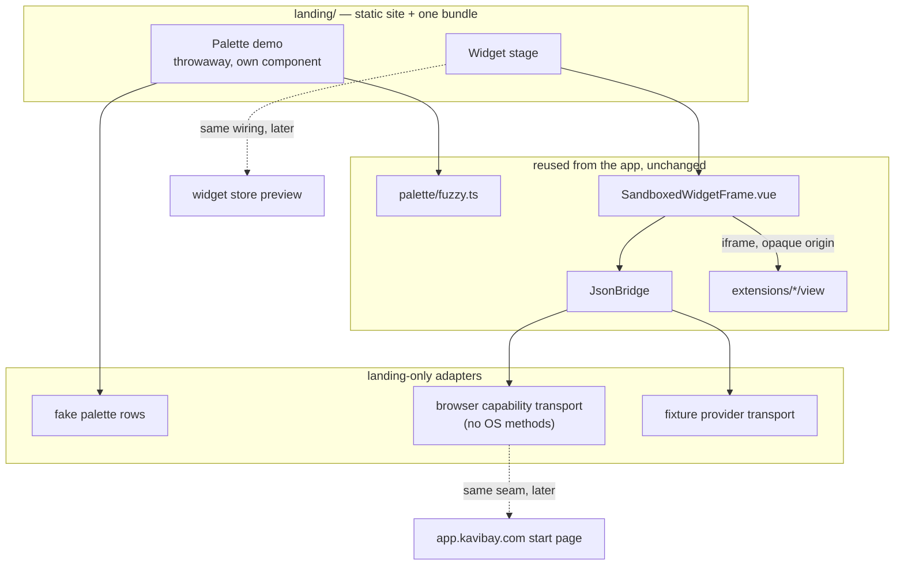

# Landing demo, store preview, and the web runtime

Date: 2026-08-28
Status: **L0–L1 done 2026-08-28.** L2 and later not started.
Implementation model: in-repo, sequential phases. Execution protocol in §7.

**Goal:** replace the landing page's video hero with the running product — a
palette that answers keystrokes and widgets that actually execute — and build
the widget half on the sandbox path, so the marketing page is the first
customer of the future web runtime instead of a parallel implementation of it.

**Product sentence:** the visitor uses Kavibay before installing it.

This is not "port the app to the web". The desktop app stays primary. What this
plan protects is the property that makes a browser start page and a widget
store possible later: the widget contract does not know where it runs.

---

## 1. Outcome

When complete:

- The hero shows a palette the visitor can type in, with real fuzzy matching
  and real highlight ranges, and no video file for that section.
- The widget section runs at least three real widgets inside sandboxed iframes
  on a plain https origin, with fixture data.
- Nothing in the landing bundle imports `@tauri-apps/*`, and nothing imports
  `core/app/extensions/registry`.
- A widget that declares an OS-bound capability renders the runtime's
  unavailable state rather than failing.
- The landing bundle stays small enough to ship in a hero: target ≤ 120 KB gzip
  JS for both sections combined.
- Every page still renders completely with JavaScript disabled, and every
  indexable page carries a hand-written head with Open Graph, Twitter card and
  canonical tags that no script touches.
- `landing/` is still an ordinary static site. Its entire integration is one
  script tag plus `<kavibay-palette-demo>` and `<kavibay-widget>` elements in
  its markup — the same two elements a generated store page will place.
- The wiring in the widget section is the same wiring a store preview needs, so
  the store's first phase is a change of data source, not a new runtime — and
  the widget descriptions written as markup here are the same ones
  `store.kavibay.com` will serve per widget.

---

## 2. Decisions and boundaries

| Decision | Reason |
|---|---|
| **The palette demo is a throwaway copy, not the real component** | `CommandPalette.vue` is 6235 lines with no props and no emits — a singleton wired to settings, runtime extensions, desks, onboarding and 13 `invoke` sites. Reusing it means either stubbing Tauri or trimming the catalog, and every landing tweak then risks the app. Measured cost of the real one as a standalone bundle: 2.8 MB JS. |
| **The palette demo reuses `fuzzy.ts` and nothing else from `palette/`** | The matching and the highlight ranges are what make a fake palette feel real, and that file is pure and Tauri-free. `paletteResults.ts` expects catalog row shapes; hand-rolled rows are cheaper than reproducing them. |
| **The widget demo uses the sandbox path, not the in-process path** | Mounting `WidgetCard` with bundled views is cheaper (measured 212 KB / 61 KB gzip) but puts widget code in the page's own origin. That is the one shortcut a store may never take. `SandboxedWidgetFrame` costs about a day more and *is* the store's preview runtime. |
| **Fixture data only in the browser, never real accounts** | There is no OS keychain on the web and there must not be a substitute. A preview shows what a widget looks like, not the visitor's data. |
| **Packages are never served from the page's own origin** | On the desktop the opaque origin is defence in depth. On a shared web origin with a session it is the primary defence. Establish the separate-origin habit while the only "package" is a first-party demo. |
| **Videos stay for mobile and `prefers-reduced-motion`** | A live palette on a phone is a poor experience, and reduced-motion needs a still fallback regardless. |
| **No backwards compatibility is required** (maintainer decision, 2026-08-28) | There are no users. Breaking stored settings, layouts or storage keys is acceptable. This is a licence to simplify, not an obligation to. |
| **Every page stays server-rendered HTML; the bundle is progressive enhancement** (maintainer requirement, 2026-08-28) | The site must work for search engines and AI crawlers. Most crawlers that matter — and every OG unfurler: Slack, WhatsApp, Discord, X, iMessage — never execute JavaScript. A fact that only exists after hydration does not exist. |
| **Widget previews are decoration, never content** | Anything inside a sandboxed iframe is invisible to every crawler, by design and irreversibly. The widget's name, category and description live in the parent document's HTML; the iframe shows it moving. |
| **Separate static documents per page, no client-side router** | `imprint.html` and `privacy.html` are files today. A store gets one real document per widget for the same reason. An SPA shell would trade the site's entire search surface for a navigation animation. |
| **The landing stays an ordinary site; the palette and widgets arrive as embeddable components** (maintainer requirement, 2026-08-28) | `landing/` is built and deployed as what it is — a static marketing site. It does not become an application that happens to show marketing. What it gains is two tags it can place in its markup. |
| **The embed package lives under `core/`, not in `landing/` and not in `sdk/`** | It has three consumers — landing, `store.kavibay.com`, `start.kavibay.com` — so it cannot live inside any one of them; a store importing from the marketing folder is backwards. It cannot live in `sdk/` either: it needs `SandboxedWidgetFrame` and `JsonBridge` from `core/app/extension-host/`, and `sdk/` is MIT and must never import from `core/` (AGENTS.md, repo map). It takes `core/`'s GPL-3.0-or-later, which is unproblematic for a public site: GPL-3.0 has no network-use provision, and the source is already published. |
| **Custom elements, not exported Vue components** | A consumer must not have to be a Vue build to embed a widget. One `<script type="module">` and `<kavibay-widget definition="…">` works in hand-written HTML, in generated store pages, and in a future app shell alike. Vue 3.5's `defineCustomElement` provides it; shadow DOM isolates the styles from the host page while CSS custom properties still inherit in, so theming keeps working. |

### Crawler and metadata invariants

Introduced 2026-08-28 as a maintainer requirement. They bind every phase in
this plan, including anything later served from `store.kavibay.com` or
`start.kavibay.com`.

1. Every `<head>` is hand-written HTML: `title`, `description`, `canonical`,
   Open Graph, Twitter card, and JSON-LD where it applies. **No JavaScript
   writes, mutates or injects a meta tag, a title or a canonical, ever** — not
   the landing bundle, not a framework, not a "just for the dynamic page" case.
2. Every page must be complete and legible with JavaScript disabled. Load it
   with scripting off before calling a phase done; what remains is what a
   crawler sees.
3. No fact that matters for search lives only inside an iframe, only in a
   `<canvas>`, or only after hydration.
4. Marketing and catalog pages are static documents. `start.kavibay.com` — the
   app — is the exception and is explicitly *not* an SEO surface; it may be a
   single application shell, and should carry `noindex`.
5. `imprint.html` and `privacy.html` keep `noindex`. That is correct and is not
   an oversight to fix.

### Security invariants for this work

1. Every widget iframe stays `sandbox="allow-scripts"` with **no**
   `allow-same-origin`, on the landing page exactly as in the app.
   `scripts/extensionHostSandboxGuard.assert.mjs` states the app-side rule; the
   landing copy must not become an exception to it.
2. Frame identity is the `contentWindow` reference, never `event.origin` — an
   opaque origin reports `"null"` and proves nothing. Never read the instance
   id back out of a message payload (finding 16).
3. The landing bundle contains no credential, no token, no API key, and no
   provider that could hold one. Fixture transports answer from constants.
4. No landing code may import `core/app/extensions/registry` (see §3, the eager
   glob) or `@tauri-apps/*`. Enforce with an assert script rather than a review
   habit.
5. Guest documents are **classic scripts**. A `type="module"` script does not
   load inside an opaque origin at all (finding 17); `sdk/contract-guest/
   kavibay-contract-guest.js` is the iife build that exists for this reason.
6. When package delivery becomes a thing, it gets its own origin with its own
   CSP response headers. A browser cannot set a per-iframe CSP the way
   `src-tauri/src/runtime_extensions/protocol.rs` does for `kavibay-ext://`; a
   server must send it.

---

## 3. What was measured (2026-08-28)

This section exists so the next agent does not re-derive these by reading code
and guessing. Every number below came from a build or from the running app, not
from an estimate. Re-measure before trusting them if the tree has moved on.

| Question | Measurement |
|---|---|
| Does the app run in a plain browser tab? | Partly. At `localhost:1420` without Tauri the DOM renders — palette input, widgets menu, desk bar — and every `mounted` hook then throws at the first `invoke`/`listen`. The palette input measures `0×0`, because visibility arrives as the `palette:show` Tauri event. A browser embed must own its own open state. |
| What does the real palette cost as a standalone bundle? | 2.8 MB JS + 232 KB CSS, minified. |
| How much of that is the palette itself? | ~200 KB: 149 KB for `CommandPalette.vue`'s script, ~51 KB for its sibling `.ts` logic. About 7%. |
| Where does the rest come from? | Two eager globs in `core/app/extension-host/bundledExtensions.ts`: line 94 `import.meta.glob("/extensions/*/extension.ts", { eager: true })` and line 107 the same for `view.ts`. Between them they pull all 32 extensions and everything those import — ~2.4 MB of extension code and ~1.0 MB of tiptap/prosemirror that exists only because `notes` is in the folder. Correct for the app, fatal for a landing bundle. |
| Which imports reach that magnet? | Three, and all three must be refused in a web bundle: `core/app/extension-host/bundledExtensions.ts` directly; `core/app/extension-host/widgetViews.ts`, which builds its map from it; and `core/app/extension-host/cockpit.ts`, which imports both *and* `tauriProviderTransport`. `core/app/extensions/registry` reaches `cockpit` through `loadExtensions.ts:12`, which is how the palette inherited the whole catalog. |
| Correction, recorded because it was wrong here first | `core/app/extensions/loadExtensions.ts:25` also globs `/extensions/*/index.ts` eagerly, and an earlier draft of this plan named it as the cause. It matches **zero files** — extensions are `extension.ts` + `view.ts`, never `index.ts`. Blocking only `core/app/extensions/*` would therefore have left the real magnet reachable. Verify a glob's matches before believing it. |
| Was the 47 MB of inlined audio real? | No — an artifact of the probe's `build.lib` mode, which force-inlines assets. The real app build emits 31 separate media files under `dist/assets`. The maintainer intends to replace the bundled audio with URLs eventually (2026-08-28), which removes the question entirely — but `build.lib` would still inline whatever assets remain, so the rule against it in L0 stands on its own. |
| What does the in-process widget path cost? | `WidgetCard` + `clock` + `todo`: 142 modules, 212 KB JS (61 KB gzip), 44 KB CSS (5.6 KB gzip). Compiles with no Tauri present. |
| How many widgets can run without the OS? | **21 of 32**, by their own `capabilities:` declaration. Method: a scan of `extensions/*/**.ts` for `capabilities: { … }` keys, classified against an OS-bound list. It is a declaration census, not a runtime check, and its regex also catches nested keys (`stocks` reports `hosts`/`methods`, which are fields of its `http` declaration). Redo it rather than extending it if the exact split matters. Browser-capable: calculator, calendar, clock, confetti, emoji-picker, gallery, github, moodist, notes, one-purpose-llm, pomodoro, redacted, snake, stocks, stopwatch, tado, time-tracker, timer, todo, weather (+ `kill-port`, which is the one extension with a direct `invoke` and should be treated as OS-bound). OS-bound: ai-usage, alarm, clipboard, color-picker, focus-tracker, image, launcher-buttons, now-playing, snippets, system-info, widget-wizard. |
| Does the sandbox path need Tauri? | No. `core/app/extension-host-dev/DevBoard.vue:73` already runs it with `entryUrl: "/extension-host-sandbox.html"` — a plain URL, no `kavibay-ext://`. |
| Is the host side of the sandbox path really Tauri-free? | Yes, traced file by file: `SandboxedWidgetFrame.vue` → `bridge.ts` → `runtime.ts` → `registry`, `query-cache`, `credentials`, `data-store`, `http`, plus `settings/useDeveloperPrefs.ts`. None imports `@tauri-apps/*`. The one `invoke` match in `runtime.ts:609` is a word in a comment. `WidgetSkeleton.vue`, `WidgetError.vue`, `widgetPhase.ts` and `sandboxTransport.ts` are clean too. |
| Is the guest side equally clean? | **No, and this is the trap.** `core/app/extension-host-sandbox/main.ts:9` imports `widgetViews`, which is built from `bundledExtensions` — so copying that guest gives you every extension inside the iframe as well as outside it. A web guest must register only the widgets it shows. |
| How much palette CSS is actually reusable? | 373 of the 1562 style lines belong to the `.palette-input` / `.palette-results` / `.palette-item` families. The rest is desk tabs, add-menu, arg chips and the widget overview popout. |
| What does a custom-element bundle cost before any of our code? | Vue's minified runtime is 106 KB, **40 KB gzip** (`vue.runtime.esm-browser.prod.js`, 3.5.40). Any bundle budget must treat that as a floor, not squeeze it. An earlier draft of this plan set a 50 KB gzip total, which left 10 KB for everything and would have pushed an implementer into dropping Vue or stripping the styles. |
| Does the widget contract know about users, accounts or sessions? | No. `sdk/extension/contract/sdk.ts` has 14 matches for user/account/session/owner/tenant and not one of them refers to the person using the app. Identity is entirely host-side today. |
| Is `ctx.data` ready for a remote store? | Yes. `WidgetDataStore` (`sdk.ts:737`) is already `Promise`-returning. The synchronous `StorageBackend` in `core/app/extension-host/data-store.ts:41` is only the local implementation behind it. |
| Is provider access ready for a hosted broker? | Yes. `ProviderTransport` is three methods — `fetch`, `capabilityFetch`, `isConnected` — carrying no credential in either direction, and `tauriProviderTransport.ts` documents itself as "the only place in the extension host that knows Tauri exists". |
| What does "no backwards compatibility" buy today? | `core/app/host/layoutLogic.ts` carries three schema generations (`kavibay:layout-v2/-v3/-v4`), a `SavedLayoutV2` struct, `migrateV3ToV4`, `upgradeLegacyPinFields` and `layoutLogic.pinMigration.assert.ts` — migration logic for installs that do not exist. |

---

## 4. Implementation phases

Do these in order. Each has an acceptance criterion; do not start the next one
until the current one passes.

### The embed package — shape

Everything L1 and L2 produce lives in one place, proposed `core/embed/`, and is
built to a single self-contained bundle plus its stylesheet. It exports custom
elements and nothing else:

| Element | What it is |
|---|---|
| `<kavibay-palette-demo>` | The throwaway marketing palette. Scripted typing, fake rows, real fuzzy matching. Not the real `CommandPalette.vue`. |
| `<kavibay-widget definition="…">` | One real widget in a sandboxed iframe, with fixture data. Optional attributes for size and for which fixture set to use. |

The consumer's whole integration is one script tag and the element in its
markup. `landing/` is the first consumer and stays an ordinary static site; the
same bundle is what `store.kavibay.com` embeds in generated per-widget pages
later, and what a `start.kavibay.com` shell would reuse.

Rules that follow from where it lives:

- `core/embed/` is GPL-3.0-or-later like the rest of `core/`. SPDX headers are
  required in `sdk/**` and `examples/**`, not here — follow the surrounding
  `core/` convention.
- It may import from `core/app/extension-host/`, `core/app/palette/fuzzy.ts`
  and `@sdk`. It must **not** import `core/app/extensions/*` (see L1) or
  `@tauri-apps/*`.
- Nothing in `landing/` is imported by the package. The dependency points one
  way: consumers depend on the package, never the reverse.

### L0 — The landing gets a build step

`landing/` is static today: HTML, CSS, one `script.js`, no `package.json`, no
build. `.claude/launch.json` already serves it with `npx vite landing --port
5180`, so the tooling is half there.

The landing page is work in progress (maintainer, 2026-08-28) — its current
markup is not something to preserve. What is fixed is the **output**: a real
HTML document per page, with a head that was written, not hydrated.

Add a build that emits a JS/CSS bundle the page loads with a plain `<script
type="module" defer>` tag. Two shapes are acceptable:

- **Bundle beside hand-written HTML** (simplest, right for today). A Vite
  config whose entry is the embed package (§4, "The embed package"), output
  with fixed unhashed names via `build.rollupOptions.output.entryFileNames` /
  `assetFileNames` to a path the landing serves, so a hand-written document can
  reference it stably with one `<script type="module" defer>`. The landing
  itself is not the build's entry — it is a static site that loads the result.
- **A multi-page or static-site build that emits one HTML file per page.**
  Choose this when page count grows — see the store note below. Pre-rendered
  output satisfies the crawler invariants exactly as hand-written HTML does;
  what is refused is a shell that assembles the page at runtime.

Do **not** use `build.lib`: it force-inlines assets, which is what turned a
probe bundle into 47 MB of base64 audio.

**A note for whoever gets to the store.** `store.kavibay.com` needs one
document per widget, and hand-writing thirty of them will not survive contact
with the thirty-first. The content for those pages already exists in the repo:
`extensions/*/manifest.json` carries `displayName`, `description`, `keywords`,
`categories` and `icon`, and the widget entries carry their default size. Feed
that into a build-time generator that emits static HTML per widget. The
manifests are already the single source of truth for the app's own catalog;
making them the source for the store's pages too keeps one description from
drifting from the other.

**Accept when:** the page renders fully with JavaScript disabled; the bundle
loads and mounts when scripting is on; `npx vite landing --port 5180` still
serves the source during development.

**Trap — update the AGENTS.md landing exception in this same change.** It
currently says: when a task touches `landing/`, do not run `npm run verify`.
That is correct for static edits and becomes wrong the moment the landing
imports from `core/` or `sdk/`, because a broken import there is now a
typecheck failure nobody runs. Split the rule: static-only edits keep the
exception; anything that touches the landing bundle runs typecheck.

**Done 2026-08-28.** Package at `core/embed/`, built by `vite.embed.config.ts`
(app-mode, not `build.lib`) to `landing/embed/kavibay-embed.js` with a fixed
filename. `landing/index.html` loads it with one `<script type="module" defer>`.
`npm run build:embed` / `npm run dev:landing` added. AGENTS.md landing
exception split; `core/embed/` added to the repo map. Curl of `/` returns the
headline, sub-headline and description with no JS. `npx vite landing --port
5180` serves the hand-written documents and the built file.

### L0.5 — Head and crawler baseline

Measured 2026-08-28: `index.html`, `imprint.html` and `privacy.html` contain
**zero** Open Graph tags between them, no Twitter card, no `canonical`, no
JSON-LD, and there is no `robots.txt` and no `sitemap.xml`. `index.html`'s head
is `charset`, `viewport`, `title`, `description`. The good news is that
`script.js` writes no metadata at all, so nothing has to be untangled first.

This is independent of the bundle and is worth doing before it, so that the
first phase which *could* break the rule lands in a repo where the rule is
already visible.

- Full head on `index.html`: `canonical`, `og:title`, `og:description`,
  `og:type`, `og:url`, `og:image` (absolute URL, with dimensions),
  `og:site_name`, `og:locale`, `twitter:card=summary_large_image`,
  `twitter:title`, `twitter:description`, `twitter:image`.
- A `SoftwareApplication` JSON-LD block for the product, as static markup.
- `robots.txt` and a `sitemap.xml` listing the indexable pages only.
- `imprint.html` and `privacy.html` keep `noindex`, and get `canonical` anyway.
- The OG image is a real file under `landing/images/`, not generated at
  runtime.

**Accept when:** every indexable page passes an OG/Twitter validator; `curl` on
each page returns a document containing the headline, the sub-headline and the
description text without any JavaScript having run; nothing in `script.js` or
the new bundle touches `document.title`, a `<meta>`, or a `<link rel>`.

**Trap:** OG unfurlers never execute JavaScript. If a later phase makes the
hero content dynamic, the share preview silently becomes an empty page and
nobody notices, because the bug is only visible in someone else's chat client.

**Done 2026-08-28.** `index.html` has canonical, the full OG set, Twitter
`summary_large_image`, and a static `SoftwareApplication` JSON-LD block.
`imprint.html` / `privacy.html` keep `noindex` and gained canonical.
`landing/robots.txt` + `landing/sitemap.xml` list only the indexable page.
OG image is `landing/images/og.jpg` (1280×741, copied from `desktop.jpg`).
`curl` on `/` returns headline, sub-headline and description. Guard in
`scripts/embedImportGuard.assert.mjs` fails if embed or landing JS writes
`document.title`, a `<meta>`, or a canonical. Slack/Facebook/X unfurlers were
not run: they need a public URL, and this was verified against localhost.

### L1 — Palette demo

Built in the embed package as `<kavibay-palette-demo>`. It owns its open state,
its rows, and a small script that types a query and walks the results. It is a
throwaway marketing component — deliberately not the real `CommandPalette.vue`
— but it lives in the package rather than in `landing/`, so a store page can
place the same element without importing from the marketing site.

Reuse: `core/app/palette/fuzzy.ts`, and the CSS rules for `.palette-input`,
`.palette-results` and `.palette-item` — measured at 373 of the 1562 style
lines in `CommandPalette.vue`. The remainder is desk tabs, add-menu, arg chips
and the widget overview popout, none of which appear here.

**The refused-import list**, to be enforced by an assert script in the style of
`scripts/importBoundaries.assert.mjs` and wired into `npm run verify`. Nothing
in the embed package, and nothing `landing/` loads, may import:

| Refused | Why |
|---|---|
| `core/app/extension-host/bundledExtensions.ts` | The magnet. Two eager globs over `/extensions/*/extension.ts` and `/extensions/*/view.ts` pull all 32 extensions and ~1 MB of tiptap. |
| `core/app/extension-host/widgetViews.ts` | Builds its map from `bundledExtensions`, so it pulls the same. |
| `core/app/extension-host/cockpit.ts` | Imports both of the above **and** `tauriProviderTransport`. |
| `core/app/extensions/*` | Reaches `cockpit` through `loadExtensions.ts:12`. This is how the palette inherited the whole catalog. |
| `core/app/palette/paletteResults.ts` | Its functions expect catalog row shapes and reach the registry through them. Hand-roll the rows. |
| `@tauri-apps/*` | Nothing in a browser bundle may reference the IPC bridge. |
| anything under `landing/` | The dependency points one way. |

Blocking `core/app/extensions/*` alone is **not** sufficient; an earlier draft
of this plan believed it was.

**Accept when:** the embed bundle is ≤ 60 KB gzip at this phase, of which the
demo's own code and CSS are ≤ 15 KB gzip; the assert script above is green; keyboard navigation works with a real keyboard, not only
with the scripted demo; and a static HTML file containing only the script tag
and `<kavibay-palette-demo></kavibay-palette-demo>` renders it — proving the
integration is one tag, not a Vue app.

**Trap:** copying the real component's visibility logic drags in the Tauri
event that never fires, and the input then measures 0×0.

**Done 2026-08-28.** `<kavibay-palette-demo>` is a `defineCustomElement` SFC
named `PaletteDemo.ce.vue`. It reuses `fuzzy.ts` and the input/results/item
CSS families; results stay in flow (not `position: absolute`) so the input is
not 0×0. Measured production build: **79.32 KB / 30.49 KB gzip** total, of
which the demo with Vue external is **10.5 KB / 3.95 KB gzip**. (The 40 KB
gzip figure in §3 is still the unbundled `vue.runtime.esm-browser.prod.js`;
Vite tree-shakes the bundler build, so the combined gzip is below that floor.)
`scripts/embedImportGuard.assert.mjs` walks the import graph and is in
`npm run verify` (135 asserts, all green). `landing/palette-demo.html` is the
one-tag proof. Keyboard: ArrowDown moves selection. Input on the landing
overlay measured 432×67. Console on load: embed script 200, title and 16
static meta tags unchanged.

### L2 — Widget demo on the sandbox path

This is the phase that matters beyond the landing page. It produces
`<kavibay-widget definition="…">` in the embed package; `landing/` only places
the element.

Wire, inside the package:

- `SandboxedWidgetFrame.vue` and `JsonBridge`, both unchanged.
- A **browser capability transport** implementing `WidgetCapabilityTransport`
  with every OS-bound method absent. The interface has 64 methods; the web
  answers the handful that are not OS-bound and refuses the rest by not
  implementing them.
- A **fixture provider transport** implementing the three `ProviderTransport`
  methods from constants. `core/app/extension-host/fixtures/harness.ts` is the
  existing fake and the right starting point.
- A guest document modelled on `extension-host-sandbox.html`, shipped with the
  package and loading the widget as a classic script. Its URL is a property of
  the element, so a consumer that later serves guests from a separate origin
  changes an attribute rather than the package.

  **Do not copy `core/app/extension-host-sandbox/main.ts` as it stands.** Its
  line 9 imports `widgetViews`, which is built from `bundledExtensions` — so
  the guest would carry all 32 extensions inside the iframe, on top of whatever
  the page already loaded. The web guest registers only the widgets it shows,
  importing `extensions/<name>/extension` and `extensions/<name>/view`
  directly. Everything else about that file — the `SandboxGuestPort` handshake,
  the window-reference identity check, `applyTheme` — is the pattern to follow.

Pick three widgets whose value is visible in ten seconds and which need no
provider: `clock`, `todo`, and one of `stocks`/`weather` with fixture data.

Each widget's name, category and one-line description stay in the **parent
document's** HTML, beside the frame, taken from its `manifest.json`. The frame
shows the widget moving; the document is what a crawler, a screen reader and a
share preview get. With JavaScript off, the section must still read as a list
of what ships — that is the same content the store's per-widget pages will
need, which is the point of writing it as markup now.

**Accept when:** all three render inside iframes on a plain https origin; the
frame carries `sandbox="allow-scripts"` and no `allow-same-origin`; a widget
declaring an OS capability lands on the runtime's unavailable state instead of
throwing; the browser console is clean; `curl` on the page returns every
widget's name and description without a frame having loaded; and a static HTML
file with nothing but the script tag and three `<kavibay-widget>` elements
renders all three, proving `landing/` is a consumer and not a host.

**Traps:** the guest must be a classic script (finding 17). The host, not the
guest, draws skeleton, error and connect states — a widget that grows its own
loading spinner has broken the rule the gate exists to enforce. And nothing a
reader needs may live only inside the frame: iframe content is invisible to
every crawler, permanently and by design.

**Theming on a foreign page.** The host reads the tokens in
`SANDBOX_THEME_TOKENS` (`sdk/extension/contract/sandbox-guest.ts:401`) off
`document.documentElement` and pushes them to the guest. `readTheme` skips
tokens the document does not define, deliberately, so an undefined set degrades
to the guest document's own fallbacks rather than breaking — but those
fallbacks are dark-theme defaults. A consumer page that wants widgets to match
it defines that token set. This is the one piece of the frame contract a host
page has to satisfy, and it is worth writing down for the store pages too.

### S0 — Preconditions before any store opens

Not code. Recorded here so a later agent cannot open a store without meeting
them, and so the sequence is visible before someone is halfway in.

1. **Replace the sentence in `CLAUDE.md` that reads "PR review is the control
   for third-party code."** A store deletes exactly that control. Everything
   the contract does not mechanically enforce currently rests on it.
2. **No `http` and no `endpoint` capability for community widgets at launch.**
   The allowlist is documented as not being a security boundary — a widget that
   may reach one host can encode anything it read into query parameters. Data
   for community widgets comes through providers, which are host-side and
   reviewed.
3. **Treat the update as the attack, not the install.** Benign v1, malicious
   v1.1. Required before opening: signed packages, pinned versions, re-consent
   when the manifest's requests change, and a revocation list with a kill
   switch. `docs/extension-host.md` already records the re-consent gap as
   tolerable *because* everything is reviewed; a store removes that reason.
4. **Community widgets stay read-only.** No actions, no own provider, no
   commands — the rule that already applies to generated widgets, extended.
   `generatedContributionRefusal` is where it lives; widening it is a
   deliberate edit to one function, which is the point.
5. **Separate origin for package delivery, and grant checks on the server.**
   Once there is a logged-in web session, the client-side permission check is
   UX and the server's is the security. Finding 7's rule — the caller does not
   get to name what it may reach — applies unchanged, with a higher stake.
6. **Re-check finding 19** (a `select` field's options run its provider query
   with permissions bypassed). Correct when a human wrote the manifest, a hole
   when a stranger did.

### W0 — Web runtime skeleton (not now)

**Where things are served.** The maintainer's target (2026-08-28) is widgets
running on the landing page, later on `store.kavibay.com` and
`start.kavibay.com`. Those are three different jobs and should stay three
origins, because their requirements contradict each other:

| Origin | Job | Indexed | Session | Runs widget code |
|---|---|---|---|---|
| landing | Marketing. Static documents. | Yes | None | Yes, first-party demo only, in sandboxed frames |
| `store.kavibay.com` | Catalog. One static document per widget, generated from the manifests. | Yes — this is the whole point of a store | None for browsing | Yes, preview with fixture data |
| `start.kavibay.com` | The app in a browser. | **No** — `noindex` | Yes, once login exists | Yes, the user's own widgets |
| package delivery | Serving third-party widget files. | No | None | This is the code being isolated |

Package files get their **own** origin, never any of the three above. A browser
cannot set a per-iframe CSP the way `protocol.rs` does for `kavibay-ext://`, so
the isolation has to come from where the file is served. On `start` this stops
being defence in depth: a session lives there.

The crawler invariants apply to landing and store. They do not apply to
`start`, which is an application and should say so with `noindex`.

When the browser start page becomes real, it is three adapters behind seams
that already exist, plus one thing that does not.

| Needed | Status |
|---|---|
| `browserCapabilityTransport` | New, but shaped by L2 — the landing demo is its first version. |
| `hostedProviderTransport` | New file, same three-method interface. Tokens stay server-side; the invariant that keeps them out of the webview keeps them out of the browser. |
| Remote `StorageBackend` | New implementation behind an interface `WidgetDataStore` already exposes as async. No widget changes. |
| Layout and desk persistence | **The one seam that is missing.** `layoutLogic.ts` reads and writes `localStorage` directly, not through an interface. Deferred by maintainer decision; when it is next touched for any reason, put it behind a backend interface the way `data-store.ts` already is. |

**Identity — the modelling rule, decided 2026-08-28.** There are two user kinds
in the product ("anonymous desktop user", "logged-in user") and there must be
**one** in the code: a user with an optionally attached account. The anonymous
desktop user is not a special case; it is a user whose credentials happen to be
local. This keeps `isConnected(providerId)` a single question with a single
answer, and makes Kavibay Pro a change of *who answers*, not a second code path.

The test: `if (isLoggedIn)` deciding **how** something happens is a modelling
error. Deciding whether something is *shown* is fine.

Login functionality itself is out of scope and needs no preparation — see §3,
the contract does not know what a user is, so nothing accrues debt by waiting.

---

## 5. What must stay true

A later change that breaks one of these costs more than it saves. They are the
reason the vision fits the architecture at all.

1. **The widget contract stays free of identity.** No user, account, session or
   tenant in `sdk/extension/contract/sdk.ts`. It is the one part third parties
   will eventually depend on and the one part that is expensive to change.
2. **Everything crossing the widget boundary stays async and JSON-serializable**
   (CLAUDE.md invariant 6). This is what makes a remote data store and a hosted
   provider broker adapter-sized instead of migration-sized.
3. **Credentials stay host-side and out of every response** (invariant 3). On
   the web this stops being a webview concern and becomes a multi-tenant one.
4. **Trust comes from the load source; permissions come from the user**
   (invariant 1, and `widgetPackageManifest(raw, approved)`'s required grant
   argument). A store changes who ships a package, not who decides what it may
   do.
5. **`tauriProviderTransport.ts` remains the only file in the extension host
   that knows Tauri exists.** The moment a second one appears, the web target
   costs a refactor instead of a file.
6. **A host page's stylesheet may address `<kavibay-widget>`, never a class
   inside it.** `<kavibay-widget>` renders in light DOM so the widget views
   keep their own styles, which also means the page's rules reach them. The
   landing and the app independently arrived at `.widget-card`, `.wiz` and
   `note`, and each one quietly restyled the real component — a second drop
   shadow, a `will-change: transform` that would have displaced the Wizard's
   `position: fixed` menu, a card standing 31 px short inside its own body.
   None of it read as a bug; it read as a slightly different product.
   `scripts/landingCssIsolation.assert.mjs` fails the build on the next one.
   The same guard is what a store page will need on day one, for the same
   reason and against far more class names.

---

## 6. Explicitly deferred

Not in scope, and deliberately so. Listed to stop them being re-proposed:

- **Sync of any kind**, desktop↔web or otherwise. Maintainer decision.
- **Layout and desk persistence rework.** Same, with the note in W0 for
  whenever it is next touched anyway.
- **Login, accounts, Pro billing.** Nothing to prepare; see §4 W0.
- **Store UI, remote catalog, install mechanism.** Still out of scope per
  `CLAUDE.md`. L2 builds a *preview runtime*, not a store.
- **Backwards compatibility.** Explicitly not required as of 2026-08-28: there
  are no users, and breaking stored settings is acceptable. Do not spend effort
  preserving old storage schemas; do not remove existing ones as busywork
  either.
- **Google Calendar verification** — but note the dependency: the 100-user
  lifetime cap that a new client id cannot reset applies to exactly the Pro
  feature "the user does not enter their own client id". The verification is
  the lead time for Pro, not a task that follows it.
- **Multi-monitor.** Unrelated, deferred 2026-08-21.

---

## 7. Execution protocol

- One phase at a time, in order, with the acceptance criterion demonstrated
  before the next begins.
- Measure rather than reason about bundle size and browser behaviour. Every
  number in §3 came from a build or the running app; three of them contradicted
  what reading the code suggested.
- `npm run verify` per the Definition of done in `AGENTS.md`, with the landing
  exception as amended in L0.
- After finishing a phase, mark it done in this document with a short
  completion note, as the other plans in this folder do.
