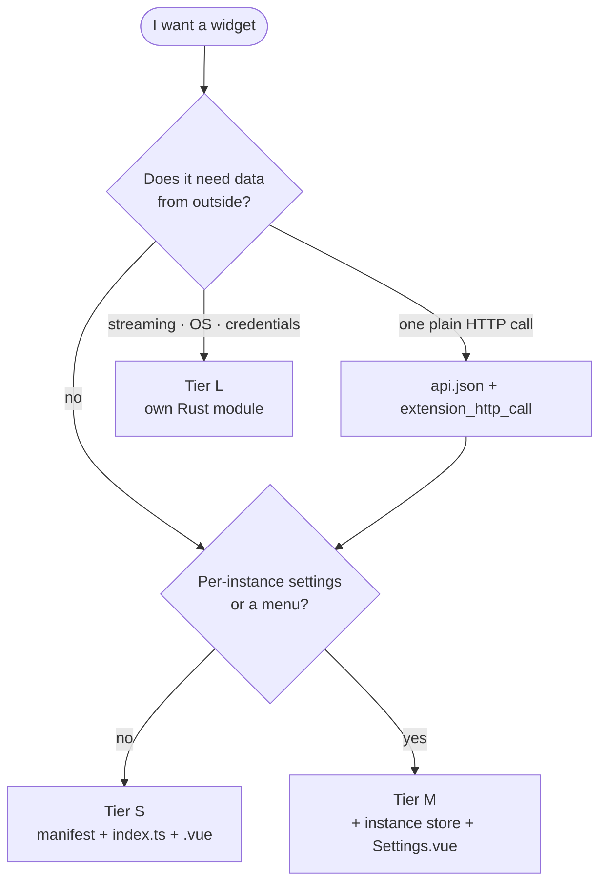
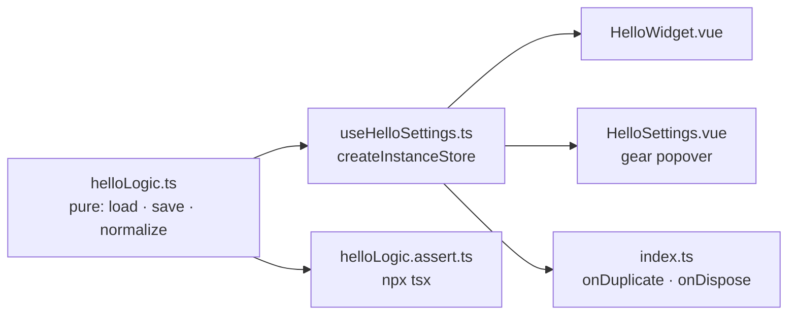

# Write your first widget

Hello world in three sizes. Pick the smallest tier that fits — going up a tier
later is cheap, and most widgets never leave **S**.

| Tier | When | Backend |
|------|------|---------|
| **S** | Client-only, or one plain API call | none, or a declared endpoint |
| **M** | Per-instance settings, menus, richer UI | same as S |
| **L** | Streaming, pagination, chained calls, shared cache/quota, OS APIs | new Rust module |



After creating the files: restart `npm run tauri dev`, then add the widget from
the command palette (`Ctrl+Space`). The Vite glob only reruns on start, so a new
folder needs a restart — editing an existing one hot-reloads.

The folder name **must** equal `manifest.id`. There is no registry file to edit.

## Tier S — a static widget

```
extensions/hello/
  manifest.json
  index.ts
  HelloWidget.vue
```

`manifest.json`:

```json
{
  "id": "hello",
  "name": "Hello",
  "description": "Says hello.",
  "version": "1.0.0",
  "author": "you",
  "keywords": ["hello", "demo"],
  "categories": ["tools"],
  "ui": {
    "defaultOffset": { "x": 0, "y": 0 },
    "defaultSize": { "w": 220, "h": 90 }
  },
  "commands": [],
  "permissions": []
}
```

`index.ts`:

```ts
import type { ExtensionModule } from "@sdk/types";
import HelloWidget from "./HelloWidget.vue";

const extension: ExtensionModule = { component: HelloWidget };

export default extension;
```

`HelloWidget.vue`:

```vue
<script setup lang="ts">
const greeting = "Hello, world";
</script>

<template>
  <div class="hello">{{ greeting }}</div>
</template>

<style scoped>
.hello {
  font-size: 16px;
  color: rgba(var(--fg-rgb), 0.92);
}
</style>
```

That is a complete widget. Use the app's CSS variables (`--fg-rgb`) rather than
fixed colours so it follows the light/dark theme, and **do not paint your own
background** — the card the host draws already is one. The rest of the house
style is in [DESIGN.md](DESIGN.md).

### Needs data from an API? Still Tier S

Declare the call in `extensions/hello/api.json`, register the file in
`src-tauri/src/runtime_extensions/first_party.rs` (one line in `DECLARATIONS`,
`include_str!`), and invoke `extension_http_call`. The host owns the URL, escapes
your arguments, refuses redirects and private addresses, and caches the response.
No Rust module and **no `connect-src` entry**.

Working examples: `extensions/weather/` and `extensions/stocks/`. Contract:
[extensions.md](extensions.md#declared-http-endpoints).

## Tier M — per-instance settings

Two copies of the same widget keep separate settings, so state belongs to the
*instance*, not the extension. `createInstanceStore` handles the cache,
persistence, duplicate and dispose.



`helloLogic.ts` — pure, so it can be tested without Vue:

```ts
import { instanceStorageKey } from "@sdk/instanceStorageKey";

export interface HelloSettings {
  name: string;
}

const DEFAULTS: HelloSettings = { name: "world" };

/** Accepts partial merges and anything from storage. */
export function normalizeHelloSettings(value: unknown): HelloSettings {
  const raw = (value ?? {}) as Partial<HelloSettings>;
  const name = typeof raw.name === "string" ? raw.name.trim() : "";
  return { name: name || DEFAULTS.name };
}

export function loadHelloSettings(instanceId: string): HelloSettings {
  try {
    const raw = localStorage.getItem(instanceStorageKey("hello", instanceId));
    return normalizeHelloSettings(raw ? JSON.parse(raw) : null);
  } catch {
    return { ...DEFAULTS };
  }
}

export function saveHelloSettings(instanceId: string, value: HelloSettings): void {
  localStorage.setItem(instanceStorageKey("hello", instanceId), JSON.stringify(value));
}

export function clearHelloSettings(instanceId: string): void {
  localStorage.removeItem(instanceStorageKey("hello", instanceId));
}
```

`useHelloSettings.ts`:

```ts
import { createInstanceStore } from "@sdk/createInstanceStore";
import {
  loadHelloSettings,
  normalizeHelloSettings,
  saveHelloSettings,
  type HelloSettings,
} from "./helloLogic";

const store = createInstanceStore<HelloSettings>({
  load: loadHelloSettings,
  save: saveHelloSettings,
  normalize: normalizeHelloSettings,
});

export function useHelloSettings(instanceId: string) {
  const { state: settings, update } = store.use(instanceId);
  return { settings, update };
}

export const disposeHelloSettings = store.dispose;
export const seedHelloSettingsFrom = store.seedFrom;
```

`HelloSettings.vue` — rendered in the widget's settings popover:

```vue
<script setup lang="ts">
import { inject } from "vue";
import { useHelloSettings } from "./useHelloSettings";

const instanceId = inject<string>("widgetInstanceId");
if (!instanceId) throw new Error("widgetInstanceId missing");
const { settings, update } = useHelloSettings(instanceId);
</script>

<template>
  <label>
    Name
    <input :value="settings.name" @input="update({ name: ($event.target as HTMLInputElement).value })" />
  </label>
</template>
```

The widget reads the same store, and `index.ts` wires the lifecycle so duplicate
and delete behave:

```ts
import type { ExtensionModule } from "@sdk/types";
import HelloSettings from "./HelloSettings.vue";
import HelloWidget from "./HelloWidget.vue";
import { clearHelloSettings } from "./helloLogic";
import { disposeHelloSettings, seedHelloSettingsFrom } from "./useHelloSettings";

const extension: ExtensionModule = {
  component: HelloWidget,
  settingsComponent: HelloSettings,
  onDuplicate: (fromId, toId) => seedHelloSettingsFrom(fromId, toId),
  onDispose: (instanceId) => {
    disposeHelloSettings(instanceId);
    clearHelloSettings(instanceId);
  },
};

export default extension;
```

Pure logic gets a colocated test — plain `node:assert`, no test runner:

```ts
// helloLogic.assert.ts — run: npx tsx extensions/hello/helloLogic.assert.ts
import { normalizeHelloSettings } from "./helloLogic";

function assert(cond: unknown, msg: string): asserts cond {
  if (!cond) throw new Error(msg);
}

assert(normalizeHelloSettings(null).name === "world", "defaults");
assert(normalizeHelloSettings({ name: "  Alex " }).name === "Alex", "trimmed");
assert(normalizeHelloSettings({ name: "   " }).name === "world", "blank falls back");

console.log("helloLogic.assert.ts: ok");
```

## Tier L — data from Rust

Only when the declared-endpoint path cannot express it: streaming, pagination,
chained calls, a shared cache or quota, or an OS API — like reading the current
user.

`src-tauri/src/extensions/hello/mod.rs` — a backend that exists for one widget
lives under `extensions/`, beside the other nine, not flat next to the host's
own modules:

```rust
//! Hello widget backend: greets the current OS user.

use serde::Serialize;

#[derive(Serialize)]
#[serde(rename_all = "camelCase")]
pub struct HelloData {
    pub greeting: String,
}

/// Greets whoever is logged in; falls back to "world" when the OS is quiet.
#[tauri::command]
pub fn widget_hello() -> HelloData {
    let user = std::env::var("USERNAME")
        .or_else(|_| std::env::var("USER"))
        .unwrap_or_else(|_| "world".to_string());
    HelloData {
        greeting: format!("Hello, {user}"),
    }
}
```

Register it in two places: one `pub mod hello;` in
`src-tauri/src/extensions/mod.rs`, and one line in `invoke_handler` in
`src-tauri/src/lib.rs` (keep the module groups sorted; it is a merge-etiquette
thing). If your module is shared by more than one extension, it is host code —
leave it at `src-tauri/src/` and say why in the PR.

Then let the host poll it. `backendCommand` + `refreshInterval` in `index.ts`:

```ts
const extension: ExtensionModule = {
  component: HelloWidget,
  backendCommand: "widget_hello",
  refreshInterval: 60000,
};
```

…and the widget receives the result as props:

```vue
<script setup lang="ts">
import type { WidgetProps } from "@sdk/types";

interface HelloData {
  greeting: string;
}

const props = defineProps<WidgetProps<HelloData>>();
</script>

<template>
  <div class="hello">
    <span v-if="props.error">Could not load</span>
    <span v-else>{{ props.data?.greeting ?? "…" }}</span>
  </div>
</template>
```

`backendCommand` is only for a **global, argument-free** poll. Anything
instance-bound (a repo, a zone, a stream) belongs in a Contract provider query
and is subscribed to from the widget's effect scope — see `extensions/tado/`
and `extensions/github/` (whose first widget is `github-actions`).

**Needs an API key or an account?** Do not build storage for it. Add one entry to
`src-tauri/src/credentials/registry.rs` and you get the settings form, the OAuth
flows and the encrypted store for free. Your Rust code calls
`credentials::resolve_for_type(&app, "yourType")`; the widget only ever learns
*whether* it is connected. See
[extensions.md → Credentials](extensions.md#credentials-api-keys-oauth-accounts).

## Want a palette action?

An action lets the palette do something to your widget without opening it: find
the row, press `Tab`, type `1h`, press `Enter`. Metadata in the manifest, handler
in `index.ts` — [extensions.md → Palette actions](extensions.md#palette-actions).

## Verifying

```bash
npx vue-tsc --noEmit
```

```bash
npx tsx extensions/hello/helloLogic.assert.ts
```

```bash
cd src-tauri && cargo test --lib
```

Then the part no test covers: add the widget, duplicate it, change a setting,
delete it.

## Copy from a neighbour

| Want | Look at |
|---|---|
| The smallest complete widget | `extensions/calculator/` |
| Settings + instance config | `extensions/clock/` (on the contract, not this tutorial's format) |
| A declared HTTP endpoint | `extensions/weather/`, `extensions/stocks/` |
| Credentials + instance-bound provider data | `extensions/tado/`, `extensions/github/` |
| Keyboard-heavy UI | `extensions/snake/` (`playground` flag) |

The full catalogue, with tier and notes for each: [../extensions/README.md](../extensions/README.md).

## No build step at all?

A **runtime package** is plain HTML/CSS/JS dropped into a folder — no Vue, no
Rust, no recompile, and it runs sandboxed. That is the right shape for something
you want to share with someone who is not going to clone this repo:
[runtime-packages.md](runtime-packages.md).
