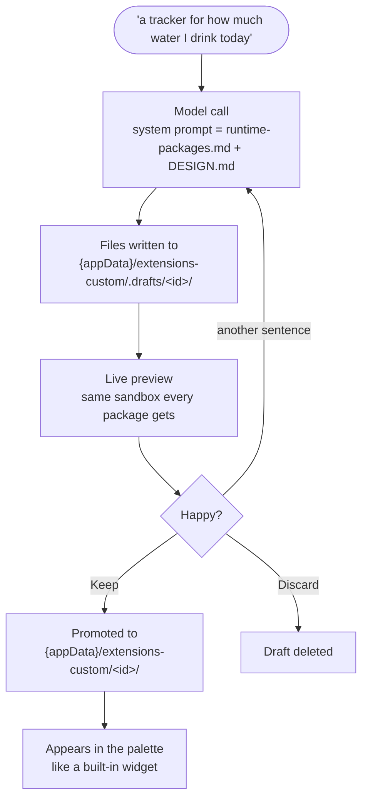

# The Widget Wizard

Describe a widget in plain language and watch it get built. The Wizard is a
normal first-party widget (`extensions/widget-wizard/`) that generates a
**runtime package** — the sandboxed, no-build-step kind — so nothing it produces
can reach further than any other untrusted drop-in.

Add it from the command palette like any other widget.

## What happens when you type a sentence

The left column is a list of **projects**. A project is a widget and every
conversation about it — the draft it has, the version on your desk, the
transcripts that got it there. Pick one to change it: the Wizard checks the
widget out into a draft, sees its current files, and **Save** replaces it in
place.

It used to be three groups — *My widgets*, *Conversations*, *External drafts* —
which are three places a widget is stored rather than three kinds of thing. One
widget could hold a row in all three at once, with different files behind each
and nothing saying which was the real one. A project is the unit somebody
actually works in: nobody opens "a draft", they go back to the water tracker. A
conversation that has not produced a package yet is a project too — an unnamed
one — rather than a fourth kind of row, because that is what it is about to
become.

**You arrange the list; it does not arrange itself.** Drag a project by the
handle that appears on hover, or press Alt+↑ / Alt+↓ on its row.

The drag is built on **pointer events, not HTML5 drag-and-drop**. The webview
gives OS-level drag to the host window, and an in-page `dragstart` is not
reliably delivered there — a handle that works everywhere except inside the app
it was written for is worse than no handle. The list also reorders *under* the
pointer rather than on release: a drop that shows its result only after the
button is up is a guess until it is too late to correct. A project list is not a feed: sorting it by activity
means the row you are reaching for moves while you reach, and the shelf you
built — this one at the top because you are living in it, that one below because
it is done — is rebuilt behind your back every time anything is written.

The only automatic placement is for a project the order has never seen, and it
goes to the **top**, newest work first among several. A project created a second
ago is the one thing you are certain to want next, and filing it at the bottom
of forty rows is the same as hiding it. It is written into the stored order
immediately rather than merely displayed there, so it does not move again when
the next one is created. The order lives in the extension's shared store, not
the card's: a second Wizard on another desk would otherwise be a second answer
to a question that has one.

**A dot before the name, and nothing else.** It answers one question: can the
palette run this yet. A filled green dot is a saved package you can add from the
palette; amber is a saved package with newer unsaved changes; a hollow ring is
a draft that has never been published. The ring is drawn in the theme's
foreground, so it stays visible on the light sidebar.

Every row used to carry a second line — what changed, who changed it, how long
ago — which answered questions nobody asks while scanning a list, and cost every
row twice its height to do it. Eight projects took 470 pixels; they now take
324. None of it is deleted, it is moved: the dot's tooltip still says which of
the two states the project is in and when it last changed.

**The sidebar reads like a harness's thread list.** Codex and Claude Code were
the reference: no box around the list, a flat **New project** entry at the top
with the sidebar toggle beside it, a quiet **Projects** label, and rows set close
together. The list used to sit in a framed panel and the open project's
conversations on a grey ground of their own. Both are gone, because the rows'
own hover and selection fills already structure the list.

**Conversations hang off their project by indentation alone.** Their text starts
in the project name's column, they carry no status dot, and they are set
lighter, which is what keeps six conversations from reading as six projects. An
unfolded project gets a little air after its conversations. The status dot sits
in a column as wide as the New project icon, so every name starts where that
label starts.

**Only one row reads as open.** The project line carries the selection until its
conversation has a row of its own; once the project is unfolded, the selection
moves down to that conversation. While the Wizard is working, a small spinner
marks the same row at its end, in place of the conversation's age, the way a
harness marks a running thread.

**The selected row uses the app's own selected-row treatment** — the same
`--row-selected-*` tokens the command palette draws its current row with: a
tint, a rim and a sheen. Hover is a flat fill. Before, the two were drawn on
different elements — selection on the whole row, hover on the button inside it —
so they were two greys of nearly the same value in two different shapes, and the
row under the pointer looked like the row that was open. Both now paint the same
box, and the selected one differs in *kind* rather than in strength.

The ring is hollow rather than a filled white disc. Filled, it is the brightest
thing on the row and pulls the eye to every unfinished project before it reaches
any of the names — and "not there yet" is what the state means.

Two widgets with the same display name are different folders and cannot be
merged, so both of those rows name their folder after the title; the rest do
not. That id gives up width three times faster than the name when the row is
narrow, because the name is the half worth reading.

**Conversations live in the project.** Clicking a project opens it and unfolds
it; clicking the one that is already open just folds it back. That is why there
is no separate fold control: re-opening what is already open would cost a round
trip to the draft service and add another "Editing…" line to a transcript nobody
asked to change, and once that is avoided the row can answer both questions
itself. The caret sits **after the name** rather than before it — on the left it
is a column of arrows the eye has to cross to reach the first letter of every
row.

Opening one of the conversations also reopens the project through the draft
workspace. A transcript stores chat history, not an independent copy of the
widget: if Codex or Claude changed the widget after that transcript was saved,
the current draft wins and appears in the files and preview. The same
reconciliation runs when the Wizard mounts, so an MCP event missed while the
card or app was closed does not leave the visible project on stale files.

A row's controls (**+**, the reorder handle and **×**) appear on hover and lie
over the end of the row, where the text fades out beneath them. They take no
width at rest: when they sat beside the name, invisible but still laid out,
every name was cut off after a few letters next to an empty stretch of row.

**+** on the row starts a new conversation in that project, without opening
anything first. It only appears where there is a project to start one in: a row
that is nothing but a conversation has no second one to offer. The project is
unchanged by it — same widget, same draft, same files, same grants; only the
transcript is new.

A conversation is only written to disk once something happened *in* it — a
request, a sentence typed but not sent, or a change to the package that produced
a version to go back to. Opening a project records a checkpoint and a system
note, and treating that as content is what left eight transcripts behind a
project somebody had opened eight times, each holding nothing but "Editing…".
Ones that already exist read **No request yet** rather than repeating the
widget's name, so they can be told apart from the ones that hold work.

Each conversation is labelled by **what was asked first**, not by
the widget's name: a conversation's stored title is the widget it is about, so
six conversations about the water tracker were six rows reading "Water Tracker".
The first request is derived from the stored payload rather than saved a second
time, so conversations that already exist get a label without being rewritten.
Beside it, how long ago it was touched — which is what makes a column of
near-identical requests navigable. That is the useful
shape once a widget exists and the next thing to do is unrelated to how it got
built, because the model is sent the files as they are on disk with every
message rather than its own last answer.

**Editing a widget goes through the draft workspace, always.** Opening one
copies it into `.drafts/<id>` — the same checkout an MCP client makes — and the
palette keeps serving the saved version until you press Save. Before, opening a
saved widget read its installed files straight into the conversation, which made
it the one path that never touched the draft service: an MCP client could not
see the work until some later edit happened to create a draft, and if a draft
was already there this read the older saved files and published over it on the
first write, with a revision that validates and no conflict ever detected.

**One widget, one conversation.** Opening the same widget twice continues where
you left off rather than starting a fresh transcript. Five edits used to leave
five identically named rows and four transcripts nobody would find again; older
ones are still reachable under *n earlier conversations* on the row.

## Drafts from local MCP clients

The Widget Wizard and the embedded [authoring MCP server](mcp-server.md) are
two clients of the same draft workspace, and the left column does not sort by
which one made a draft. A draft an MCP client created appears as a widget row
like any other, and opening one records an **Opened MCP draft** checkpoint. Its
byline can name Codex or Claude Code when the MCP handshake supplied that
identity; otherwise it remains generic MCP.

What the column *does* say is who wrote it last. The host keeps a note beside
each draft — `.drafts/.<id>.origin`, deliberately outside the folder so it
cannot enter the content revision — and every surface reads the same field:
the row's byline, the checkpoint in the transcript, the conflict banner, and
`lastWriter`/`lastClient`/`lastClientName` in the MCP server's own `list_drafts` reply, so a client can see
that a person is editing before it writes.

The attribution remains on the project row after the short-lived presence
indicator expires. Known clients keep their Codex or Claude Code mark until the
draft is saved or discarded; a generic MCP writer keeps a generic mark. A saved
widget with pending draft changes uses the amber project dot, so the installed
and draft states remain one row without hiding the fact that they differ.

If an open draft is changed by MCP while the Wizard is clean and idle, the
complete file set, revision, validation state and preview update immediately.
The conversation records an **Updated via Codex**, **Updated via Claude Code**
or generic **Updated via MCP** checkpoint (with a supplied client mark when
known), but no artificial user or assistant message is added. Hovering the
checkpoint, version or sidebar status shows the exact `clientInfo.name`, even
when the visible label stays generic. A generation in progress, a pending Wizard
write or an unsaved textarea edit blocks automatic replacement and shows an
explicit conflict banner instead:

- **Reload their version** adopts the external snapshot and records a checkpoint.
- **Keep my version** writes the local complete file set against the external
  revision. If it changed again meanwhile, the Wizard keeps the conflict open
  rather than overwriting the newer revision.

The header and project row also show ephemeral MCP presence. A pulsing client
mark means a draft-scoped MCP tool is executing at that moment; once it returns,
the copy changes to "was active just now" and disappears after 60 seconds. The
tooltip includes the last tool. Presence is memory-only and deliberately does
not claim that Codex or Claude is still thinking between observable MCP calls.

There is no automatic three-way merge. An event for another draft only refreshes
the sidebar, and the Wizard ignores an event for a revision it has already
applied. The banner names whoever actually wrote the other version: it used to
say "changed via MCP" whatever the origin field held, so a second Wizard card
editing the same draft accused a client that had never run. The
[MCP server guide](mcp-server.md) describes the complete file-set and
`expectedRevision` workflow.

Saved custom widgets can be edited through MCP as well, by the same route the
Wizard takes. The client reads a palette widget with `read_custom_widget`,
checks out its current revision with `checkout_custom_widget`, and then works on
the resulting draft. The palette keeps serving the saved version while the draft
is being edited; only the Wizard's **Save** action replaces it.

## Starting one from the palette

**New Widget** (Ctrl+Space → "new widget") opens the Wizard on a fresh project.
The host resolves the card before the handler runs — a visible Wizard wins, a
hidden one is revealed, otherwise one is created — so the action itself only has
to decide which project is showing, and the answer is a new one. The caret lands
in the composer, because a new project is a question waiting to be typed.

**It opens with the chrome folded away.** No project list, no name field, no
Chat/Code switch — all three describe a package that does not exist
yet, and somebody who just pressed "New Widget" has one thing to do. The caret
is in the composer and there is nothing above it.

The **header** comes back by itself once the first generation produces a
package: the name field then names something and Code has files in it, so the
reason for hiding it has expired. There is no button to leave the mode — a mode
you have to leave is one people get stuck in.

The **sidebar** does not. It stays folded until it is asked for, because it is a
list of *other* projects and finishing this one is not a reason to be shown
them — the widget that just appeared is the thing to look at. The toggle is the
one way out, which is why it cannot be conditional on anything.

The fold is deliberately *not* stored. Whether this card's sidebar is collapsed
is a preference living in its `ctx.data`, and it has to survive being briefly
overruled — so the palette's fold is a separate flag that goes away again. The
sidebar's own **New project** entry does not fold anything: it is the same
act arrived at from a place that just used the sidebar.

The action is declared **`needsInstance: false`**, which is what gives it a row
of its own. A widget action with an instance looks like the right shape and is
unreachable: the palette runs a *type* row by opening the widget, and the action
attached to that row only feeds its keywords — so the handler never runs and the
Wizard opens exactly as it always does. That was the first version of this, and
it did nothing visible at all.

Opening the card is therefore the handler's job, and it delegates it rather than
doing it: it asks the host for a Wizard and leaves the request where the host's
own focus event will deliver it. The host reveals a hidden card, focuses a
visible one, or makes a new one, then tells *that* instance it has the caret —
so the request lands on the card the host chose instead of on whichever one the
extension guessed at. A request no card ever answers expires after five seconds,
so it cannot ambush the next deliberate open.

The action's row also **replaces the Wizard's catalog row** in search results
(`"replacesCatalogRow": true`). Both rows opened the Wizard and only one of them
also started a project, so the other was noise. The **+** menu and the gallery
build their lists from the catalog directly and still offer it.

`newWidgetAction.assert.ts` pins the dispatch, the single redemption and the
expiry; `paletteResults.assert.ts` pins that the catalog row goes and that
Snippets' instance-less action — which never opens its widget — keeps its own.

## What it needs

An API key for one model provider: **Settings → Integrations → Credentials →
Anthropic** or **OpenAI**. Generation is billed by that provider and costs a few
cents per widget.

The picker sorts models you have a key for to the top and preselects one of
those. Only models flagged `authoring: true` are offered — a small open-weight
model produces a package that fails validation, which reads to the user as the
Wizard being broken rather than as a bad model choice.

**Adding a model** is one entry in `MODELS` in `src-tauri/src/llm/catalog.rs`:
id exactly as the provider expects, label, one-line note, provider, vendor (for
the logo — Cloudflare serves other people's models), and the `authoring` flag.

## Seeing and editing the files

The middle column switches between **Chat** and **Code**, plus **API** when the
package declares endpoints or reads from a provider; the preview is its own column on the right and never
moves. The switch is one segmented control with an icon per face, and the open
face is lifted with the app's selected-row treatment. When the column is too
narrow for the labels, only the icons stay, each with its name as a tooltip.
Arrow keys move between the faces once the switch has focus. The header shows
the widget's name and nothing else: the package id is a folder name, which
matters to the files and to MCP clients but not to somebody building a widget.

Both dividers are draggable, and arrow keys on a focused divider move them too.
The left divider only resizes. Hiding the sidebar is the panel icon beside
**New project**; folded away, the same icon sits at the top left, level with the
header, because the divider track is the one place still on screen when the
header is hidden while composing.
Widths live in the widget's own `ctx.data`, so they belong to this Wizard on
this desk rather than to whichever conversation was open when you dragged them.
Below about 620px the side columns fold away on their own and the conversation
takes the card — three columns in that width are three slivers, not three
columns. Reading a file and watching what it does are one activity, so the file
view does not cover the widget — it replaces the transcript, which you are not
reading at that moment anyway.

Code shows the package the way an editor does: one panel with the file tree on
the left and the open file on the right, under its path. Folders such as `ui/`
are rows of their own with their files indented beneath, folders before files,
and each file carries an icon coloured by its kind (JSON, HTML, script, CSS,
image). The tree is built by `fileTreeRows` in `widgetWizardLogic.ts`.

Code lists
everything the package is made of — `manifest.json`, `index.html`, `widget.js`,
`api.json` — and each one is editable. An edit is written to the draft when the
field loses focus; a `.json` file that does not parse is reported and not
written, so the package on disk stays the one that worked.

**Versions.** Two places, one history.

In the **conversation**, under each answer that produced a package: a green dot
saying "This is what is on disk", or **Back to this version**. That is where the
question is actually asked — "go back to before I said change the background" is
a sentence about the conversation, and a strip of timestamps somewhere else
makes the reader translate it into one about clocks. A hand edit gets its own
line there too, so the transcript stops implying that each answer followed the
previous one when it did not.

In the **Code tab**, above the file list: one button per state, with times.
The compact overview, for when you know you want "two back" rather than a
particular message.

This is the only way back there is. Every generation rewrites the **complete**
file set, so when the fifth answer breaks what the fourth had working, the
previous version exists nowhere: not on disk, not usably in the transcript, and
not with the model, which reasons from the files it was last sent. Asking it to
undo was the only recovery, and it is unreliable for exactly that reason. Hand
edits had the same hole from the other side — `applyFile` overwrites, and the
textarea's own undo dies with the next generation.

Going back is not a one-way door: the version you left stays in the list, so you
can go forward again. Five are kept (`VERSION_LIMIT`) — the useful answer to
"that broke it" is almost always the version immediately before, sometimes two
back, never the ninth.

Saving does not add an entry. It rewrites `ui.defaultSize` to whatever the
preview was left at, which changes the bytes without being a step anybody took,
so the live snapshot is patched in place instead.

JSON, script, HTML, CSS and SVG files are syntax-highlighted by
[`highlight.ts`](../extensions/widget-wizard/highlight.ts), a few hundred lines
with no dependency. `highlightLanguage` in `widgetWizardLogic.ts` picks the
scanner from the file's kind. In HTML, the bodies of `<style>` and `<script>`
are read as CSS and script, because that is most of a generated `index.html`.
CSS colours what can be told apart by position alone: selectors, property
names, numbers and colours, at-rules and `!important`. Value words such as
`grid` stay plain. The editor is a coloured `<pre>` under a textarea whose text
is transparent, so the field stays a real textarea and keeps undo, selection
and IME. Regular-expression literals, template interpolation and JSX are not
recognised and render plain; a highlighter this size is better unhelpful than
confidently wrong.

**Your edit is the next turn's starting point.** The model is sent the files as
they are on disk with every message, not its own last answer, so a change you
made by hand is the version it changes. Before, only the manifest was editable
and only the initial open seeded the model — an edit made mid-conversation was
written to disk and then silently overwritten by the next reply.

Editing `api.json` re-opens the endpoint review: the consent is bound to the
declaration's exact bytes, so changing them means the person has not yet seen
what the widget would now call. The editor says so before you find out as a
`consent_stale` error.

## Notes in the transcript

Opened, updated, renamed, discarded — the Wizard reports what happens to the
package, and there are a lot of those. They are **centred and quiet**, on a
light grey ground, as wide as their own text rather than the column. As
full-width amber boxes they were the loudest thing in a transcript whose subject
is the two voices in it, and eight in a row read as eight warnings.

The ground is one step above the page and one below your own messages —
`28,28,32` for the page, `42,42,45` for a note, `51,51,54` for a bubble you
typed — so the three read as a scale rather than as three unrelated colours. No
ground at all was the first attempt and went too far the other way: skippable to
the point of invisible.

**A system message that asks a question is not a note** and keeps a message's
shape — full width, left edge, a box. A consent screen and an Enable put a list
of capabilities in front of somebody and wait for an answer, so they get the
width to be read in. What does *not* disqualify a note is a button: an "Add to
desk" or a "Fix it" is one optional convenience attached to a report. Counting
those as dialogs made the note that says "Saved" the widest and loudest thing in
the transcript — a full-bleed green slab announcing a step that had gone fine.
`isPlainNote` decides by what the bubble carries, not by how it is worded.

A note that produced a package state carries its **Back to this version**
checkpoint underneath — outside the grey box, on the page, and hidden until the
pointer is on the turn.

The footnotes used to sit *inside* the bubble, which was invisible while no
bubble had a ground of its own. Once notes were given one, a reserved-but-empty
row turned every note into a mostly-empty grey box, and filling it put a button
in the middle of what is otherwise a sentence. A bubble and its footnotes are
now one `.wiz-turn`: the bubble keeps its ground and holds only its text, the
footnotes stack under it on the page. The reserve stays — a row that appears
under the pointer would push every later message down — but it is reserved in
transparent space, where nothing looks unfinished.

Notes have a **minimum width** as well as a maximum. Centred boxes sized purely
to their text turn a column of notes into a zigzag — "Updated via MCP" is a
third the width of the line above it, and the eye follows the edges instead of
the words.

## Reasoning effort

Model and effort share one control
([`WizardModelMenu.vue`](../extensions/widget-wizard/WizardModelMenu.vue)). The
trigger states both — `5.6 Luna High` — so what is about to run is readable
without opening anything; inside, a row per setting opens its own list with a
tick on the current value.

One control rather than two because they are read together and answer one
question. Two dropdowns side by side spent the width of the composer row saying
the same thing in two places.

Effort levels are **Default / Low / Medium / High / Extra high / Max**, and the
row is hidden entirely for a model that does not take the parameter — some
return an error when it is present at all, so there is no setting to grey out.
Higher means the model thinks longer, which costs more and answers slower; the
default is the provider's own, which is not the lowest level.

The words track the API values rather than being reworded: `low` reads as "Low",
not "Light", so comparing this against a provider's documentation does not
require a translation step.

Which levels exist is **data, not a rule in code**. `effortLevels` in
`src-tauri/src/llm/models.json` states them per model, because the two providers
do not share a vocabulary — Anthropic takes `low | medium | high | xhigh | max`
in `output_config.effort`, OpenAI takes `minimal | low | medium | high | xhigh |
max` in `reasoning_effort` (plus `none`, deliberately not offered) — and the two
overlap without matching, so the level travels exactly as the catalog stated it
rather than through an equivalence nobody published.

**An empty list means never send it.** Some models return an error when the
parameter is present at all rather than ignoring it, so a model whose support
has not been checked lists nothing and the row does not appear.

The list is a **subset** of what each API takes, on purpose. OpenAI's `none`
switches reasoning off, and the wizard's job is a complete package that survives
validation — the same argument `authoring` already makes about small models:
what comes back is broken, and a broken package reads as the wizard being broken
rather than as a setting somebody chose. It is not cheaper either, since the
repair round spends a second request on the mess. Because the host validates
against this same list, leaving a level out refuses it rather than merely hiding
the button.

Three Rust tests pin it: every declared level belongs to its provider's
vocabulary, no model offers `none`, and the one model known to reject the
parameter declares nothing.

The level is checked host-side against the catalog and refused otherwise — same
rule as `format` and `providers`: what a widget sends is *which* of the allowed
things it means, never a value that widens the request.

Switching models drops a level the new one has never heard of, rather than
sending it and failing. Your choice is kept, not overwritten, so switching away
to compare a price and switching back does not lose it.

## What a widget costs

The wizard shows it as it happens. **Hover an answer** and its footnotes fade
in: what that turn cost — `4.2k in · 2.7k out · 11.1k cached · Sonnet 5 ·
~$0.03` — and the checkpoint for the package version it produced. Beside the
composer, always visible: the running total for the conversation.

They are hidden because they are answers to questions you only sometimes ask,
and two permanent extra lines under every answer made the transcript harder to
read than the conversation in it. The row still **occupies its height when
hidden** — revealing it by growing the bubble would push every later message
down the moment the pointer crossed an older one, and the message under the
pointer is the one thing that has to hold still. Only the ink fades.

The checkpoint is a real button, so the row also appears on `:focus-within`: it
stays tabbable while invisible, and one reachable only by pointer is one a
keyboard cannot reach at all. On touch, where there is no hover, the footnotes
are simply always shown. The Code tab's version strip is unaffected either
way — that is the always-visible route to the same thing.

**The token counts are exact.** They come from the provider's own `usage` block,
which was already in every response and simply being discarded — no character
count divided by four. The money is an estimate from the price in
`src-tauri/src/llm/models.json`, marked `~` because a price can be an
introductory rate that lapses or a tier the catalog does not model.

**Each turn is priced when it runs, and keeps that price.** The line names the
model that answered, and the cost stored beside it is the one that model
charged. The first version recomputed every line against whatever the picker
held at the time of rendering, so changing the model rewrote what past turns had
cost — a conversation's history moving because of a dropdown. The model that
ran comes from the reply, not from the picker, which can move while a request
is in flight.

The conversation total is a sum of those stored figures. One turn on a model
with no listed price — or in another currency — withdraws the total rather than
understating it: a sum quietly missing a turn is a wrong number, and this one is
money.

**"in" means everything you sent that did not come from cache.** The three input
buckets are billed at three rates and stored apart — plain, written to cache
(1.25×), read from cache (0.1×) — but a new message is largely written *into*
the cache, so it lands in the write bucket. Showing only the plain one made
every turn read as "3 in" however much had been typed, with the difference in a
bucket the line never named. Fresh plus cached is now the whole prompt, which is
a sum you can check against your own message; hovering the line splits it the
way it is billed.

Cached tokens are named separately rather than folded into a total, for two
reasons: they are billed at a tenth, so hiding them makes a cheap turn look
expensive — and `cached` staying at zero across a conversation is the one signal
that the caching has broken. Nothing else on screen would say so.

The two providers disagree about what "input" means — Anthropic's `input_tokens`
excludes cached tokens, OpenAI's `prompt_tokens` includes them — so `usage_of()`
normalises both to the *fresh* part. Reading them the same way made a
well-cached OpenAI turn look several times more expensive than the identical
Anthropic one, which is a wrong number in the direction that would make somebody
undo the caching.

Generation is billed by your model provider. A five-turn widget with a
mid-sized package is roughly **$0.08 on Sonnet 5, $0.20 on Opus 5** — about a
quarter of what it was, after three changes.

**The system prompt and the conversation are cached.** `providers.rs` sets two
`cache_control` breakpoints on Anthropic requests: one on the system block
(~24 KB of `runtime-packages.md` + `DESIGN.md`, byte-identical on every
request), one on the newest turn. Caching is a prefix match and the history only
ever grows, so each request re-reads everything before the new question at a
tenth of the price.

OpenAI places its own breakpoint — `prompt_cache_options.mode` defaults to
`implicit`, on the latest user message, which is where the Anthropic one goes by
hand. GPT-6 routes cache requests automatically, so `prompt_cache_key` is not
needed for cache hits; the stable key derived from the system prompt groups
cache accounting for the same instructions. Explicit mode is deliberately not
used: it would switch OpenAI's own breakpoint off and put the placement here,
where a mistake loses caching that currently works.

**Nothing may rewrite the history.** Trimming superseded file sets out of older
turns looks like the obvious next saving and is the opposite — it changes the
prefix, so every turn would pay a full re-read *plus* a fresh write. Append
only.

**The package is no longer sent twice per round.** The model returns the
complete file set every turn, so its own last answer already holds the files
verbatim; repeating them in the next question doubled the package in every round
and kept paying for the duplicate in every replay of that turn. `TurnContext.knownFiles`
records what it has seen, and the files ride along only when they differ — after
a hand edit, a restored version, or a save that rewrote `ui.defaultSize`. Absent
means send them, which is the safe direction: a spare copy costs tokens, a
missing one costs a widget.

**A follow-up answer returns only what changed.** Output is billed at five
times input, and rewriting a whole package to change one line was the largest
remaining cost. `mergeGeneratedFiles` applies an answer to the package instead
of replacing it, so the model is told — per turn, never in the cached system
prompt — to send only the files it touches.

That inverts one rule, and both halves matter: **an omitted file is now kept,
not deleted.** The host cannot tell "I did not touch it" from "I meant to remove
it", so silence keeps the file, and removing one takes an explicit
`deleted=true` on the fence. Both system prompts say so, and a Rust test pins
that they do — a prompt that drifts back to the old wording would make the model
drop files by leaving them out, with nothing on screen to say why.

The risk is a model that forgets a file it should have changed. That is what the
preview, the automatic repair round and the version history are for; the first
turn is never offered the partial form, because there is nothing to be partial
against.

Screenshots are worth knowing about: an attached image stays in the conversation
and is re-sent with every later request. Cached now, but the first one is still
the largest single thing a message can carry.

## The size a new widget opens at

A generated package opens at whatever the model wrote into `ui.defaultSize`, and
that guess is usually short — so the first thing a new widget did was scroll.

**The card now grows to fit its own content.** The guest measures itself and
reports the height; only it can, because the frame is sandboxed to an opaque
origin and its layout is not readable from outside.

**And the document is usually not what overflows.** A widget writes
`html, body { height: 100% }` and puts its list in a box with `overflow: auto`,
so the page fits *by construction* however much content there is — measuring
`documentElement.scrollHeight` then reports a perfectly fitting page above a
list that is scrolling. Measured on exactly that shape: document 220px in a
222px frame, overflow 0, and 118px hidden inside the list. So what is reported
is the document plus the largest hidden remainder of any scrolling element in
it — the real question being how much taller this would have to be for nothing
to scroll. What travels is the
*overflow* — how much taller the content is than the box it was given — so the
card grows by exactly what does not fit, with no card padding, title bar or
border modelled anywhere. It converges by construction: once the content fits,
the overflow is zero.

**Up to a ceiling** (`PREVIEW_FIT_MAX_HEIGHT`), which is the other half of it. A
list with no natural end must keep its scrollbar rather than growing until it
fills the screen.

Two things stop it. A card that has been **dragged** is a size somebody chose,
and growing it again would be taking that back — so fitting stops for that
widget, and starts again for the next one, because the flag is about the card on
screen and not about the person. And the fitted size is stored the same way a
drag is, which is what writes it into the package's `ui.defaultSize` on Save: a
preview that fitted itself and forgot would leave the widget opening short on
the desk, which is the same bug one step later.

The report is a **bubbling DOM event**, not a component emit. The two frames sit
at different depths — the runtime frame is a direct child of the preview chrome,
the contract one is behind `ContractPackageWidget` and `CockpitWidget` — and
threading a prop through those would add a parameter to two generic components
for one caller. The listener sits on the preview's own element, so a widget
running on the desk cannot resize the wizard's card by reporting a size.

## Providers and endpoints

The **API** tab appears once the package declares endpoints or names a provider
in `widget.requires.providers`.

**Providers** come first. A widget on a provider calls no API of its own:
Kavibay makes the requests and the widget asks for queries by name, so a weather
widget built on `kavibay.weather/weather` has no `api.json` and, before this,
showed no API tab at all. Each provider is a card with its state (no account
needed, connected, not connected with a button to connect, or not available on
this Kavibay) and its queries, each as a call and an answer shape, such as
`places(name) → list of { id, name }`. All of it comes from the host's provider
catalog; nothing is called. Running a provider query for a draft would be a new
host capability, and the calls the preview makes are already listed under
**Debug** beside it. `providersUsedBy` in `widgetWizardLogic.ts` reads the
manifest and matches it against the catalog.

## Trying an endpoint

Every endpoint the package declares in `api.json` is listed below the providers
with its parameters, a **Try** button, and what came back.

This is the shortest fix for the longest loop in the wizard. Building against
an API used to go: describe it, get a widget, run it, watch it render
`undefined`, go find the real field names, say them out loud, repeat — because
the model was *guessing* the response shape and a guess renders as nothing
rather than as an error. One request replaces all of it. The captured response
travels with your next message, and the model writes against real field names.

The tab says which of the two states a kept response is in — waiting to be sent,
or already sent. It goes **once**, like the current files: a sample resent every
turn is the same tokens billed again for a fact the model already has. Large
responses are clipped to `SAMPLE_MAX`; the first two thousand characters carry
the shape, and the two hundredth hourly reading teaches nothing.

**The response goes to your model provider.** That is the point of it, and it
is also a real data flow — a tado° reading or a GitHub issue list is your data
leaving the machine. The tab says so next to every captured response, and
**Discard response** drops it before it is sent.

An endpoint with a `credential` can be tried only when the widget behind the
draft already holds a grant for it. A draft of something that was never kept has
no install record and reaches nothing — `Caller::Draft` in
`src-tauri/src/runtime_extensions/http.rs` refuses it, and the tab says so
rather than offering a button that cannot work.

A draft of an *installed, granted* widget is that widget being edited, so it
reaches the grant — under one further condition: its `api.json` must be
byte-identical to the declaration the grant was given for. A regenerated
declaration is a different set of requests, so a model that rewrites it cannot
point a granted credential at a host nobody approved; that is `consent_stale`,
the same answer a kept package gets for the same change. Refusing every draft
outright meant the one endpoint such a widget exists for could not be tried at
all, and the person had to save an untested change to find out whether it
works — which is the loop this tab was built to remove.

Nothing new is reachable from here. The probe calls
`runtime_extensions_http_call` with the same ext id the preview frame is already
mounted with, so it reaches exactly what the preview reaches — the declaration,
the allowlist, https-only, the private-address refusal, the size cap and the
budget are all the same Rust path. The wizard parses `api.json` only to know
what to draw; Rust remains the authority on what it means.

`ctx.wizard` is handed out on `capabilities.wizard`, which only a widget
compiled into the binary can declare — `widgetPackageManifest` never reads
`capabilities` out of a package manifest at all, and
`widget-package.assert.ts` pins that.

## When a generation comes back broken

The wizard checks every package it receives — the reply parses into files, the
files write, the code does not call a bridge it never loaded or a
`localStorage` that throws in the sandbox. When a check fails, the problems go
back **to the model**, not to you, and the answer is regenerated before you are
told anything.

That is the whole trick: the wizard already knows in exact words what is wrong.
Printing it to a person so they can paraphrase it back makes them a courier
between two parties that both have the words already.

The retry is announced in the transcript — "That package has a problem —
asking for a fix: …" — because it is your tokens and a second answer appearing
with no explanation reads as the model changing its mind.

**Once per message** (`REPAIR_BUDGET` in `widgetWizardLogic.ts`). A second
automatic retry is a different bet: the model has by then seen the problem,
failed at it, and been told again, and nothing on screen would distinguish that
from still thinking. If the repair is also broken, both problems are reported
and it is your turn.

Runtime faults — the widget threw, a promise rejected — get a **Fix it** button
instead of an automatic turn. A widget throws for reasons no regeneration
touches: a token that is not set yet, an API that is down, a laptop that is
offline. You are the only one here who knows which it is; the click is still
one action instead of reading the panel and retyping it as a sentence.

One offer per preview run. A widget throwing inside a timer produces the same
fault every second, and a transcript growing a button every second is a fire
alarm, not an offer — the rest are in the panel below, which is where a list
belongs.

## Who names the widget

**The model does, on the first turn.** It has just read the request and can say
what the thing *is*; the Wizard used to slug the whole request into an id and
dictate it, which is how a widget came to be called
`a-tracker-for-how-much-water-i-drink` — a sentence in a field that becomes a
folder name, a palette entry and a url host.

So turn one asks for two things instead of stating one: a short id, and a
display name of one to three words in the language of the request. The id is
adopted from the manifest the answer writes, and the name fills the name field
if it was left empty. A name typed before sending still wins — that was said on
purpose.

**A name already in use gets a number.** The model has no way to know what this
machine already holds, so a collision is not a flaw in its answer: the wizard
takes the first free id at or after the one it chose — `water-tracker`,
`water-tracker-2`, `water-tracker-3`. Drafts and saved widgets are one namespace
for this, because promoting a draft onto a saved id is refused. The number is
appended to the whole id rather than counting up through one already inside it:
`gpt-5` becomes `gpt-5-2`, never `gpt-6`, which would be a different name rather
than the same name twice. The manifest is rewritten to match — the folder is
named by the manifest, so a suffixed write whose manifest still said the
original would rename the draft straight back onto the name it was avoiding.

That collision used to arrive as **a package problem**, which sent the answer
back to the model for a repair round it could not perform and charged for the
turn. Anything the draft service refuses outright — a name in use, a quota, a
disk that said no — is now reported to the person instead, because they are the
only one who can act on it.

From the second turn on the id is settled and stated to the model again, because
renaming is the person's act and not a side effect of asking for a change. The
validator follows the same split: it checks the manifest *agrees* with the id
once there is one, and on the first turn only that what the model chose is a
name a folder can carry.

## Which model it opens on

The catalog says. `authoringDefault` in `src-tauri/src/llm/models.json` names one
model per provider, and the Wizard starts on it whenever that provider is
connected — GPT-6 Luna for OpenAI. It used to take the first configured model
in catalog order, which put whichever entry happened to be listed first in
charge of what a generation costs, and that file's order is maintained for other
reasons entirely. A choice already made is still kept: switching away to compare
a price and back again is not undone by this.

## Renaming a widget

A package's folder name *is* its identity — the scanner refuses any package
whose manifest names a different folder, and the sandbox resolves a widget's own
directory through that name. So renaming is one edit in one place: the manifest
(`name` for a contract package, `id` for a runtime one). The host moves the
folder to whatever the manifest says, and the Wizard follows it.

Three routes reach the same write. Typing in the **name field** slugifies it and
patches the manifest for you. Editing `manifest.json` in the **Code tab** does
it directly. An **MCP client** writing a draft with a different name in the
manifest renames it the same way, and the reply says where it moved
(`id` plus `renamedFrom`).

Renaming used to be a discard: the draft was thrown away and the next answer
rebuilt the widget under the new name, spending a generation — and your hand
edits — on a change of name.

A draft rename moves the draft only. The widget already on your desk keeps its
old name until you press **Save**, which retires it: the folder is removed, and
the install record — the enabled flag, the granted permissions, the credential
grants, the api hash — moves to the new name rather than being asked for again.
Your cards keep their position, their titles and their stored data; both are
carried over with the id.

A name another draft already uses is refused (`draft_exists`), because merging
two drafts would destroy one of them. A name that is not a usable directory name
— spaces, punctuation, a leading dash — is not a rename at all: the file is
written as typed and the validator says `invalid_package_id` next to it.

## Save, where the widget is

**Save / Save & Run / Discard float over the preview**, at the top left of the
stage. At the foot of the column they were below the debug panel — three
rows away from the thing they act on, and the last item in a column whose
subject is at the top.

Absolute rather than a row, so the preview keeps the whole column instead of
giving up a row's height to them. **Top left**, where a column is read from and
away from a widget that sits in the middle of the stage. No panel behind them:
each button already carries its own ground, and a second one around the group
was a slab over the grid holding three things that were legible without it.

The cost is that a widget taller than the stage passes underneath them. That is
what floating means, and the alternative — reserving a row at the top — is the
height this change gave back.

## Approving automatically

Under the consent screen there is **Approve automatically from now on**. It
arms the bypass that already existed — the `wizardAutoEnable` switch in
**Settings → Developer** — from the one place somebody actually decides they are
tired of the dialog, rather than a settings page they would have to go looking
for while holding a half-saved widget.

It is the same switch, not a second one. The host normalises the write against
the Developer Extensions gate and answers with what the setting ended up as, so
a request it refuses shows as refused instead of leaving a control that looks on
and does nothing. Without Developer Extensions the switch is not offered at all.

**It grants exactly what the package asked for** (`autoApprovedGrant`) — every
provider the manifest declared that this machine actually has, the changes it
declared on them in `requires.actions`, and nothing else. An action the provider
does not have lands in `refused`, so the dialog is shown instead.
A bypass that reached past the request would be granting access the widget never
declared, which is a different and much larger thing than skipping a click.

**Skipping the click never changes the outcome.** If a provider the package
named is not installed here, or nothing in the request resolved at all, the
dialog is shown anyway (`canAutoApprove`). The first version of this applied
whatever the request contained, so a package whose provider id did not resolve
was enabled with an *empty* grant — no dialog, no note, and a widget in the
preview saying it needed a permission nobody had been asked for.

A bug it also fixes: the bypass had never applied to a **contract** package's
provider grant, only to a runtime package's permissions. Armed, it silently did
nothing here — one switch with two meanings depending on which format the answer
happened to be.

**With the switch on, a contract package also saves itself after each turn.**
A contract widget cannot run as a draft — it reads from a provider, the grant
lives on the install record, and a draft has no install record — so the preview
of every unsaved one is the *Not approved yet* gate. Honest, and also the whole
preview: for the one format whose point is reading real data, that is iterating
blind.

It rides the same switch as the consent it skips, for the same reason: it does
something a person would otherwise do by hand every turn. Off by default,
because saving puts a widget in the palette and that is not a side effect to
hand out unasked. It refuses a package the validator already rejected — saving a
broken one would replace a working widget with it — and it will not save again
while a consent screen it produced is still unanswered, which would put a second
copy of the same unanswerable question under the first.

**And the preview no longer lets a widget report this itself.** A saved contract
package that still cannot read what it declared gets the host's gate — *Cannot
read yet*, naming what is missing — instead of being mounted to fail.
`contract-packages.md` tells authors to ignore `error` because "the host is
already showing it, outside your frame"; with nothing shown here that was a
cheque the host did not cash, and the model wrote its own red panel — the
inconsistent error UI the contract exists to prevent.

## After Save

The note offers an **Add to desk** button rather than telling you to go and find
the widget. It fires the same event `Save & Run` does, so there is one path that
places a widget instead of two that could drift apart.

It used to say "add it from the palette with Ctrl+Space", which asked somebody
to search for a thing they had just made, under a name they had not chosen.

**The palette does have it now, the moment the save returns.** It did not,
and the reason was two registries that never spoke: the wizard runs its own
package scan through the reviewed capability, the host's `syncWidgetPackages`
holds the widget *definitions* a package mounts, and the palette's catalog is
built from a third thing — the runtime registry's own scan. A save updated the
first two and left the third, so a widget could be installed, enabled and absent
from the palette until anything else happened to rescan.

Wiring it is an inversion rather than an import: the runtime registry already
imports the host, so the host announces and the registry listens. Only the
wizard path announces — the registry calls `syncWidgetPackages` at the end of
its own scan, and a listener on that would answer its own notification for ever.

A package that still needs its permissions reviewed is saved but not enabled, so
it appears once that is answered. That is the consent step, not the gap.

## The debug panel

Under the preview, and open by itself whenever something failed. It shows one
sequence of everything that happened in this preview, newest first:

- **Calls** the widget made to the host — `endpoint.call`, `provider.query`,
  `data.set` — with their arguments, timing, HTTP status, and on failure the
  host's own code and message. That code is the point: `unknown_endpoint` means
  the id is wrong, `consent_stale` that the declaration changed since you
  approved it, and `permission_denied` that the network was never enabled —
  three different fixes behind one sentence the widget wrote.
- **Faults** the widget reported about itself: an uncaught throw with its
  `widget.js:42:9`, a promise nobody awaited, a `console.error` from a catch
  block, or a file the package HTML referenced that did not load.

The faults are the newer half and the reason for the merged list. Before, a
widget that threw wrote a good message to a console inside a sandboxed frame
that cannot be opened, so a broken widget was simply blank — and the panel,
which only knew about calls, said "nothing yet" for both "it is fine" and "it
died before it got started". The reporting installs before the package's own
script, so a parse error and a top-level throw are caught too.

An empty panel is now a diagnosis in itself: no calls and nothing thrown means
the script never ran at all, so check that the package HTML loads it under the
name the file actually has.

Both package formats report the same shape, from two hand-kept-parallel guests
(`sdk/extension/contract/sandbox-guest.ts` and `sdk/runtime/kavibay-runtime.js`,
held together by `scripts/guestFaultReporting.assert.mjs`). A fault is text to
display and nothing else — the host derives nothing from it, which is what makes
it safe to accept from the code being debugged.

**Credentials are stripped on the way in.** Messages and stack traces are free
text produced by widget code, and `Failed to fetch …?token=abc` is the ordinary
shape of one. `core/app/extension-host/redact.ts` replaces the value and keeps
the name — `token=***` still tells you a token was sent, which is usually the
fact that solves the problem. It is display hygiene for screenshots, not a
security boundary: a widget can print its own token in any shape it likes.

## Attaching images

Drop a screenshot or a mockup on the input box, paste it, or use the Image
button, and ask for a widget that looks like it. Each provider gets the image in
its own block shape (`src-tauri/src/wizard/providers.rs`); oversized images are
refused before the request rather than by the provider.

## What it cannot do

This is the part worth knowing before you let a model write code on your machine:

| | |
|---|---|
| Writes only into | its own drafts directory under `{appData}/extensions-custom/.drafts/` |
| Cannot touch | a widget that arrived from a folder or a store — promoting over an **installed** package is refused (`id_already_installed`) |
| Preview runs in | the standard runtime sandbox: `sandbox="allow-scripts"`, `connect-src 'none'`, no storage |
| Credentials | runtime packages may not declare any; the manifest validators reject the field |
| Network | only through endpoints declared in `api.json`, and only after you reviewed them |

So a bad generation produces a broken preview and nothing else.

**Replacing a widget re-opens the review.** A promoted package keeps its install
record, so grants survive — but the `api.json` hash changes with the bytes, which
makes the consent stale. A changed version that uses the network has to be
reviewed again before it may reach anything.

## Why the system prompt is a doc you can read

`src-tauri/src/wizard/prompt.rs` embeds
[runtime-packages.md](runtime-packages.md) and [DESIGN.md](DESIGN.md) verbatim
with `include_str!`. What the model knows about the package format and the house
style is exactly what is documented — there is no second, hand-maintained copy to
drift. Editing either doc changes the Wizard's behaviour; moving one fails the
build.

## Where the files live

| | |
|---|---|
| Drafts | `%APPDATA%\com.aswetlow.kavibay\extensions-custom\.drafts\<id>\` |
| Kept widgets | `%APPDATA%\com.aswetlow.kavibay\extensions-custom\<id>\` |
| Packages you installed by hand | `%APPDATA%\com.aswetlow.kavibay\extensions\<id>\` |

Settings → Extensions → Runtime packages lists all of them with their status, and
shows the exact folder on your machine. Deleting a kept widget there also forgets
what it was granted.

## Doing it by hand instead

The Wizard writes the same format you would write yourself, and the format is
documented for humans first: [runtime-packages.md](runtime-packages.md). If you
want a widget compiled into the app rather than sandboxed, that is a first-party
extension — [widget-tutorial.md](widget-tutorial.md).
